# Nexus Architecture Decisions

> **When to read this:** Before building any feature that touches data flow, cross-domain coordination, user roles, or query patterns. This is the "why" doc — the playbook covers the "how".

---

## Table of Contents

1. [Database Optimization — When to Care](#1-database-optimization--when-to-care)
2. [Sagas & Process Managers](#2-sagas--process-managers)
3. [ACID, Idempotency & Race Conditions](#3-acid-idempotency--race-conditions)
4. [Composable Queries](#4-composable-queries)
5. [Role Management — Assignment & Discovery](#5-role-management--assignment--discovery)
6. [Role-Based UX — Per-Role Experience](#6-role-based-ux--per-role-experience)

---

## 1. Database Optimization — When to Care

### Right Now: No

Nexus is in **feature-building phase**. Premature optimization will slow us down with zero benefit. Here's the rule:

| Stage                        | Optimize? | Why                                             |
| ---------------------------- | --------- | ----------------------------------------------- |
| Building features (NOW)      | ❌ No     | Tables have <1000 rows. Any query is fast.      |
| Feature-complete, demo-ready | ⚠️ Light  | Add indexes from `nexus-db-schema.md` Section 9 |
| Production with real users   | ✅ Yes    | Profile real queries, add targeted indexes      |

### What We Already Have Right

- **UUIDv7 primary keys** — naturally time-sorted, no index needed for chronological queries
- **Indexes planned per table** in `nexus-db-schema.md` — we'll add them when we create each feature's migration
- **TimescaleDB hypertable** planned for `market_ticks` — handles millions of ticks with automatic partitioning
- **Projections are disposable** — if performance is bad, rebuild from events with better schema

### What to Watch For Later

| Signal                        | Action                                                    |
| ----------------------------- | --------------------------------------------------------- |
| Dashboard load > 500ms        | Add composite index on `invoices(user_id, status)`        |
| Market chart slow             | Check hypertable chunk interval, add continuous aggregate |
| Reconciliation search slow    | Add GIN index on `match_criteria` JSONB                   |
| Statement upload parsing slow | Move to Oban background jobs (already planned for F7)     |

> [!TIP]
> **Our CQRS architecture IS the optimization.** Write-side (EventStore) and read-side (Postgres projections) are separate databases. We can tune them independently. Projections can have denormalized columns, materialized views, or even Redis caches — all without touching event logic.

---

## 2. Sagas & Process Managers

### What's a Saga in Commanded?

A **Process Manager** (Commanded's term for saga) coordinates multi-step workflows that span multiple aggregates. It listens for events and dispatches commands in response.


### When Do We Need Sagas?

| Feature                | Needs Saga? | Why                                                           |
| ---------------------- | ----------- | ------------------------------------------------------------- |
| F1: Identity Gate      | ❌ No       | Single aggregate (`User`), no cross-domain                    |
| F2: ERP Talk Back      | ❌ No       | Single aggregate (`Invoice`), self-contained                  |
| F3: Treasury Dashboard | ❌ No       | Read-only projections + PubSub, no commands                   |
| F4: Step-Up Auth       | ❌ No       | Extends `User` aggregate, single domain                       |
| **F5: Match Engine**   | ✅ **Yes**  | First cross-domain flow: invoice + statement → reconciliation |
| F6: Liquidity Forecast | ⚠️ Maybe    | May trigger recalculation when invoices change                |
| F7: Document Gateway   | ❌ No       | Single aggregate (`Statement`), background parsing via Oban   |
| F8: AI Sentinel        | ⚠️ Maybe    | Anomaly detection may trigger alerts across domains           |

### F5: Our First Process Manager

The **ReconciliationManager** is already planned in the roadmap:

```
lib/nexus/treasury/process_managers/reconciliation_manager.ex
```

```elixir
defmodule Nexus.Treasury.ProcessManagers.ReconciliationManager do
  use Commanded.ProcessManagers.ProcessManager,
    application: Nexus.App,
    name: "Treasury.ReconciliationManager"

  # When a statement row is imported, try to match it
  def interested?(%StatementRowImported{} = event), do: {:start, event.statement_row_id}
  def interested?(%TransactionReconciled{} = event), do: {:stop, event.statement_row_id}
  def interested?(_event), do: false

  # React to events by dispatching commands
  def handle(%__MODULE__{}, %StatementRowImported{} = event) do
    %ReconcileTransaction{
      statement_row_id: event.statement_row_id,
      reference: event.reference,
      amount: event.amount,
      currency: event.currency
    }
  end

  # Apply events to track state
  def apply(%__MODULE__{} = pm, %StatementRowImported{}) do
    %{pm | status: :matching}
  end
end
```

### Saga Best Practices for Nexus

| Rule                                                      | Why                                                             |
| --------------------------------------------------------- | --------------------------------------------------------------- |
| **One process manager per workflow**                      | Keep coordination logic isolated                                |
| **Process managers dispatch commands, never write to DB** | Commands go through aggregates — that's the ACID boundary       |
| **Use `interested?/1` to scope events**                   | Only listen to events this saga cares about                     |
| **Compensating actions for failures**                     | If step 2 fails, dispatch a compensating command to undo step 1 |
| **Register in `application.ex`**                          | Process managers are supervised GenServers                      |
| **Test via integration tests**                            | Dispatch initial command, assert final state                    |

### When NOT to Use a Saga

| Situation                                 | Use Instead                        |
| ----------------------------------------- | ---------------------------------- |
| Single aggregate operation                | Direct command dispatch            |
| Read-side calculation                     | Projector with multi-event handler |
| Background job (parsing, file processing) | Oban worker                        |
| Real-time notification                    | PubSub broadcast from projector    |

---

## 3. ACID, Idempotency & Race Conditions

### How ACID Works in CQRS/ES

Traditional monolith: one database, one transaction.
Nexus: **two databases, two different ACID strategies.**

```mermaid
graph TD
    subgraph "Write Side — EventStore"
        A["Aggregate.execute/2"] --> B["Optimistic Concurrency\n(stream version check)"]
        B --> C["Append event\n(atomic within stream)"]
    end

    subgraph "Read Side — Postgres"
        C --> D["Projector receives event"]
        D --> E["Ecto.Multi transaction\n(ACID within projection)"]
    end
```



| Concern         | Write Side (EventStore)                | Read Side (Postgres)                          |
| --------------- | -------------------------------------- | --------------------------------------------- |
| **Atomicity**   | ✅ Event append is atomic per stream   | ✅ Ecto.Multi wraps projection in transaction |
| **Consistency** | ✅ Aggregate validates before emitting | ✅ Changeset validations + constraints        |
| **Isolation**   | ✅ Optimistic concurrency per stream   | ✅ Postgres transaction isolation             |
| **Durability**  | ✅ EventStore persists to disk         | ✅ Postgres WAL + fsync                       |

### Idempotency — The Three Layers

#### Layer 1: Aggregate-Level (Already Built)

The aggregate rejects duplicate operations via pattern matching:

```elixir
# User aggregate — rejects registration if already registered
def execute(%__MODULE__{id: nil}, %RegisterUser{} = cmd) do
  # ... creates user (only works when id is nil)
end

def execute(%__MODULE__{id: _existing}, %RegisterUser{}) do
  {:error, :already_registered}
end
```

#### Layer 2: Projector-Level (Already Built)

Our `UserProjector` uses `on_conflict` to handle replayed events:

```elixir
project(%UserRegistered{} = ev, _metadata, fn multi ->
  # Guard against stale test data with invalid ID formats
  case Ecto.UUID.cast(ev.user_id) do
    {:ok, _uuid} ->
      user_data = %{
        id: ev.user_id,
        display_name: ev.display_name,
        role: ev.role,
        cose_key: Base.decode64!(ev.cose_key),
        credential_id: Base.decode64!(ev.credential_id)
      }

      Ecto.Multi.insert(multi, :user, User.changeset(%User{}, user_data),
        on_conflict: {:replace, [:display_name, :role, :cose_key, :credential_id, :updated_at]},
        conflict_target: :id
      )

    :error ->
      multi
  end
end)
```

**This means:** if the same event is processed twice (projector restart, crash recovery), the projection updates cleanly instead of crashing.

#### Layer 3: Command-Level (Add per feature)

For external-facing commands (webhooks, API calls), add a deduplication key:

```elixir
# In invoice ingestion — prevent duplicate SAP webhooks
defstruct [:invoice_id, :sap_document_number, ...]

# In the aggregate:
def execute(%__MODULE__{ingested: true}, %IngestInvoice{}) do
  # Already ingested, silently succeed (idempotent)
  []  # Return no events — Commanded treats empty list as success
end
```

### Race Conditions — How Commanded Prevents Them

**Commanded uses optimistic concurrency control (OCC):**

1. Aggregate loads current state (version N)
2. `execute/2` produces event(s)
3. EventStore appends events **only if stream version is still N**
4. If another process appended between steps 1-3 → `Commanded.AggregateError` → retry

```
Process A: load(v1) → execute → append(v2) ✅
Process B: load(v1) → execute → append(v2) ❌ CONFLICT → reload(v2) → retry
```

**This means:** two concurrent `RegisterUser` commands for the same `user_id` will NOT create duplicate users. The second one will retry, see `id: <exists>`, and return `{:error, :already_registered}`.

### What You Don't Need

| Don't                         | Why                                                   |
| ----------------------------- | ----------------------------------------------------- |
| Database-level locks          | OCC handles it via stream versioning                  |
| `SELECT FOR UPDATE`           | Not needed — aggregates are single-writer per stream  |
| Distributed locks (Redis)     | Single-node Elixir app, Commanded handles concurrency |
| Manual transaction management | Ecto.Multi in projectors handles this                 |

---

## 4. Composable Queries

### The Pattern: Query Modules

For each domain, create a query module that builds composable Ecto queries:

```elixir
defmodule Nexus.ERP.Queries.InvoiceQuery do
  @moduledoc "Composable queries for the invoices projection."
  import Ecto.Query

  alias Nexus.ERP.Projections.Invoice

  def base, do: from(i in Invoice)

  # --- Filters (composable) ---

  def for_user(query, user_id) do
    where(query, [i], i.user_id == ^user_id)
  end

  def with_status(query, status) do
    where(query, [i], i.status == ^status)
  end

  def in_currency(query, currency) do
    where(query, [i], i.currency == ^currency)
  end

  def since(query, %DateTime{} = since) do
    where(query, [i], i.created_at >= ^since)
  end

  # --- Sorting ---

  def newest_first(query) do
    order_by(query, [i], desc: i.created_at)
  end

  # --- Aggregation ---

  def total_amount(query) do
    select(query, [i], sum(i.amount))
  end

  def count(query) do
    select(query, [i], count(i.id))
  end

  # --- Cursor-Based Pagination ---
  # UUIDv7 keys are time-sorted, making them natural cursors.
  # Offset pagination breaks when rows are inserted between page loads.

  def after_cursor(query, nil), do: query

  def after_cursor(query, cursor_id) do
    where(query, [i], i.id < ^cursor_id)
  end

  def first(query, limit \\ 25) do
    query |> limit(^limit)
  end
end
```

### How to Use Them (Pipe-Friendly)

```elixir
# In a LiveView or context module:
alias Nexus.ERP.Queries.InvoiceQuery

# "Show me Bernard's pending EUR invoices, newest first, next 25 after cursor"
InvoiceQuery.base()
|> InvoiceQuery.for_user(current_user.id)
|> InvoiceQuery.with_status("received")
|> InvoiceQuery.in_currency("EUR")
|> InvoiceQuery.newest_first()
|> InvoiceQuery.after_cursor(last_seen_id)   # nil for first page
|> InvoiceQuery.first(25)
|> Repo.all()

# "What's my total EUR exposure?"
InvoiceQuery.base()
|> InvoiceQuery.for_user(current_user.id)
|> InvoiceQuery.in_currency("EUR")
|> InvoiceQuery.total_amount()
|> Repo.one()
```

### File Convention

```
lib/nexus/<domain>/queries/<entity>_query.ex
```

| Domain   | Query Module          | Example Use                        |
| -------- | --------------------- | ---------------------------------- |
| ERP      | `InvoiceQuery`        | Invoice list page, dashboard stats |
| ERP      | `StatementQuery`      | Upload history, parsing status     |
| Treasury | `MarketTickQuery`     | Chart data, stale detection        |
| Treasury | `ExposureQuery`       | Risk overview, heatmap data        |
| Treasury | `ReconciliationQuery` | Payment matching view              |
| Treasury | `ForecastQuery`       | Cash flow outlook chart            |

### Rules

| Rule                                               | Why                                                          |
| -------------------------------------------------- | ------------------------------------------------------------ |
| **Always scope by `user_id`** (except market data) | Data isolation for RBAC                                      |
| **Never write queries inline in LiveViews**        | LiveViews call context functions that use query modules      |
| **Return queryables, not results**                 | Let the caller decide `.all()` vs `.one()` vs `.aggregate()` |
| **Add query modules per feature**                  | One query module per projection table                        |

---

## 5. Role Management — Assignment & Discovery

### The Three Roles — Recap

| Role     | Default? | Who Gets It                                 |
| -------- | -------- | ------------------------------------------- |
| `trader` | ✅ Yes   | Every new user after biometric registration |
| `admin`  | ❌ No    | Manually assigned by existing admin         |
| `viewer` | ❌ No    | Assigned by admin for read-only access      |

### How Role Assignment Works

#### For `trader` (Automatic)

No action needed. The `RegisterUser` command defaults `role: "trader"`. Every biometric registration creates a trader.

#### For `admin` and `viewer` (Admin UI)

We need two new domain artifacts:

```elixir
# New command
defmodule Nexus.Identity.Commands.AssignRole do
  @enforce_keys [:user_id, :new_role, :assigned_by]
  defstruct [:user_id, :new_role, :assigned_by]
end

# New event
defmodule Nexus.Identity.Events.RoleAssigned do
  @derive Jason.Encoder
  @enforce_keys [:user_id, :new_role, :previous_role, :assigned_by, :assigned_at]
  defstruct [:user_id, :new_role, :previous_role, :assigned_by, :assigned_at]
end
```

#### Aggregate Guard

```elixir
# In User aggregate — only admins can assign roles
def execute(%__MODULE__{id: _id} = state, %AssignRole{} = cmd) do
  # The caller must be an admin — verified before dispatch in the LiveView/context
  if cmd.new_role in ["admin", "trader", "viewer"] do
    %RoleAssigned{
      user_id: state.id,
      new_role: cmd.new_role,
      previous_role: state.role,
      assigned_by: cmd.assigned_by,
      assigned_at: DateTime.utc_now()
    }
  else
    {:error, :invalid_role}
  end
end
```

### Admin Interface for Role Management

An admin-only page accessible from the sidebar:

```
┌────────────────────────────────────────────────┐
│  MANAGE USERS                        (Admin)    │
├────────────────────────────────────────────────┤
│                                                │
│  Name/ID          Role       Registered  Action │
│  ────────         ────       ──────────  ────── │
│  Bernard          admin      Feb 18      —      │
│  trader_7F3A...   trader     Feb 19      [▼]    │
│  trader_A2C1...   viewer     Feb 19      [▼]    │
│                                                │
│  [▼] dropdown options:                          │
│    • Make Admin                                  │
│    • Make Viewer                                 │
│    • Make Trader                                 │
│                                                │
│  🔒 Role changes are logged in the audit trail  │
└────────────────────────────────────────────────┘
```

### How a User Knows Their Role

**Three places:**

1. **Session status in sidebar** — shows role badge next to "Identity Verified"

   ```
   ● Identity Verified · Trader
   ```

2. **Dashboard header** — role-specific greeting

   ```
   Welcome back, Bernard · Admin
   ```

3. **Navigation visibility** — users only see pages their role allows (see Section 6)

### When to Build This

| Artifact                                    | Build During                                       |
| ------------------------------------------- | -------------------------------------------------- |
| `AssignRole` command + `RoleAssigned` event | F4 (Step-Up Auth) — same session, extends Identity |
| Admin "Manage Users" page                   | After F4, before F5                                |
| Role badge in sidebar                       | During dashboard overhaul (F3)                     |

### First Admin — Bootstrap Problem

> _"If every user starts as trader, who is the first admin?"_

**Solution: Seed script.**

```elixir
# priv/repo/seeds.exs or a Mix task
# After the first user registers via biometric, promote them:
Nexus.App.dispatch(%Nexus.Identity.Commands.AssignRole{
  user_id: "first-user-uuid",
  new_role: "admin",
  assigned_by: "system-bootstrap"
})
```

Or: an environment variable `NEXUS_ADMIN_USER_ID` that auto-promotes on first login. This is a one-time operation.

---

## 6. Role-Based UX — Per-Role Experience

### Route Access Matrix

| Route               | `trader` | `admin` | `viewer`     | Enforcement                  |
| ------------------- | -------- | ------- | ------------ | ---------------------------- |
| `/` (Identity Gate) | ✅       | ✅      | ✅           | Public — auth entry point    |
| `/dashboard`        | ✅       | ✅      | ✅           | All authenticated users      |
| `/invoices`         | ✅       | ✅      | 👁️ Read-only | Role check in LiveView mount |
| `/statements`       | ✅       | ✅      | ❌           | Route-level pipeline         |
| `/intelligence`     | ✅       | ✅      | 👁️ Read-only | Role check in LiveView mount |
| `/admin/users`      | ❌       | ✅      | ❌           | Admin-only pipeline          |

### Implementation: Phoenix Plugs + LiveView Hooks

#### Step 1: Session Plug (stores role in session)

```elixir
# lib/nexus_web/plugs/load_user.ex
defmodule NexusWeb.Plugs.LoadUser do
  import Plug.Conn

  def init(opts), do: opts

  def call(conn, _opts) do
    case get_session(conn, :user_id) do
      nil -> conn
      user_id ->
        user = Nexus.Repo.get(Nexus.Identity.Projections.User, user_id)
        assign(conn, :current_user, user)
    end
  end
end
```

#### Step 2: Role-Checking Plug

```elixir
# lib/nexus_web/plugs/require_role.ex
defmodule NexusWeb.Plugs.RequireRole do
  import Plug.Conn
  import Phoenix.Controller, only: [redirect: 2, put_flash: 3]

  def init(allowed_roles), do: allowed_roles

  def call(conn, allowed_roles) do
    user = conn.assigns[:current_user]

    if user && user.role in allowed_roles do
      conn
    else
      conn
      |> put_flash(:error, "You don't have access to this page")
      |> redirect(to: "/dashboard")
      |> halt()
    end
  end
end
```

#### Step 3: Router Pipelines

```elixir
# In lib/nexus_web/router.ex
pipeline :authenticated do
  plug NexusWeb.Plugs.LoadUser
end

pipeline :require_trader do
  plug NexusWeb.Plugs.RequireRole, ["trader", "admin"]
end

pipeline :require_admin do
  plug NexusWeb.Plugs.RequireRole, ["admin"]
end

# Protected routes
scope "/", NexusWeb do
  pipe_through [:browser, :authenticated]

  live "/dashboard", DashboardLive
  live "/invoices", ERP.InvoiceLive
  live "/intelligence", Intelligence.InsightsLive
end

scope "/", NexusWeb do
  pipe_through [:browser, :authenticated, :require_trader]

  live "/statements", ERP.StatementLive
end

scope "/admin", NexusWeb do
  pipe_through [:browser, :authenticated, :require_admin]

  live "/users", Admin.UserManagementLive
end
```

#### Step 4: LiveView Mount Guard

For fine-grained control within a page (e.g., viewer sees invoices but can't create):

```elixir
# In any LiveView
def mount(_params, session, socket) do
  user = load_user_from_session(session)

  socket =
    socket
    |> assign(:current_user, user)
    |> assign(:can_edit, user.role in ["trader", "admin"])
    |> assign(:can_manage_users, user.role == "admin")

  {:ok, socket}
end
```

```heex
<%!-- In template: conditionally show edit buttons --%>
<.button :if={@can_edit} phx-click="create_invoice">
  New Invoice
</.button>
```

### Per-Role Navigation (Sidebar)

The sidebar renders different items per role:

```elixir
def sidebar_items(role) do
  base = [
    %{label: "Dashboard", path: ~p"/dashboard", icon: "hero-chart-bar"},
    %{label: "Your Invoices", path: ~p"/invoices", icon: "hero-document-text"}
  ]

  trader = [
    %{label: "Upload Statements", path: ~p"/statements", icon: "hero-arrow-up-tray"},
    %{label: "Smart Insights", path: ~p"/intelligence", icon: "hero-sparkles"}
  ]

  admin = [
    %{label: "Manage Users", path: ~p"/admin/users", icon: "hero-users"}
  ]

  case role do
    "admin"  -> base ++ trader ++ admin
    "trader" -> base ++ trader
    "viewer" -> base
  end
end
```

### UX Differences by Role

| Element          | Trader                     | Admin                    | Viewer                       |
| ---------------- | -------------------------- | ------------------------ | ---------------------------- |
| Dashboard        | Full interactive           | Full + admin badge       | Read-only, no actions        |
| Invoice list     | Can create, view           | Can create, view, manage | View only, no "New" button   |
| Statement upload | ✅ Full access             | ✅ Full access           | ❌ Page not accessible       |
| Smart Insights   | Full access                | Full access              | View dashboard insights only |
| "Manage Users"   | ❌ Not in sidebar          | ✅ In sidebar            | ❌ Not in sidebar            |
| Step-up auth     | Prompted for trades >€100K | Same                     | N/A (no trade actions)       |
| Audit log        | ❌ Not visible             | ✅ Visible               | ❌ Not visible               |

### Visual Role Indicators

```
┌─ Sidebar Footer ────────────┐
│  ● Identity Verified         │  ← green pulse (all roles)
│  Role: Trader                │  ← role badge
│  Session: 3F8A...            │
│  🔒 Secured · Encrypted      │
└─────────────────────────────┘
```

Admin gets an additional badge:

```
│  Role: Admin 🛡️               │  ← shield icon for admin
```

---

## Quick Decision Matrix

_When faced with a design question, use this:_

| Question                                  | Answer                                                 |
| ----------------------------------------- | ------------------------------------------------------ |
| "Should I optimize this query?"           | Not until it's measurably slow                         |
| "Do I need a saga?"                       | Only if >1 aggregate must coordinate                   |
| "How do I prevent duplicates?"            | Aggregate pattern match + projector `on_conflict`      |
| "How do I handle concurrent writes?"      | Commanded OCC does it automatically                    |
| "Where do I put this query?"              | `lib/nexus/<domain>/queries/<entity>_query.ex`         |
| "Who can assign roles?"                   | Only admins, via `AssignRole` command                  |
| "How does a viewer know they can't edit?" | Buttons are conditionally rendered via `@can_edit`     |
| "Where do I check roles?"                 | Route pipeline (broad) + LiveView mount (fine-grained) |
