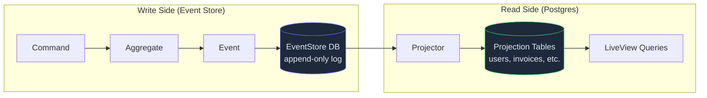
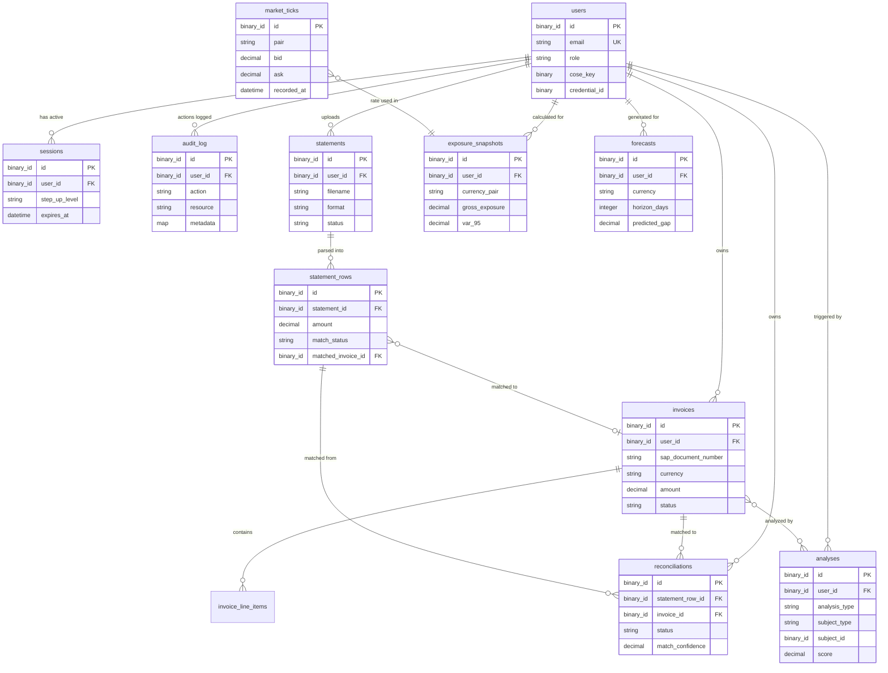

# Nexus Database Schema Architecture

> **Purpose:** This document maps every Nexus feature to its database tables, showing column definitions, relationships, indexes, and how the CQRS/ES write-side (EventStore) connects to the read-side (Postgres projections).
>
> **Convention:** All tables use `Nexus.Schema` — UUIDv7 primary keys, `binary_id` foreign keys, `utc_datetime_usec` timestamps with `created_at` instead of `inserted_at`.

---

## How Data Flows in Nexus



> [!IMPORTANT]
> **Two databases, two concerns.** The EventStore (write-side) is append-only and stores raw events forever. The Postgres projections (read-side) are disposable views that can be rebuilt from events at any time. You never write to projections directly — projectors do that by listening to events.

---

## Table of Contents

1. [Shared Conventions](#1-shared-conventions)
2. [Domain 1: Identity](#2-domain-1-identity)
3. [Domain 2: ERP](#3-domain-2-erp)
4. [Domain 3: Treasury](#4-domain-3-treasury)
5. [Domain 4: Intelligence](#5-domain-4-intelligence)
6. [Cross-Domain Relationships (ER Diagram)](#6-cross-domain-relationships)
7. [Migration Execution Order](#7-migration-execution-order)
8. [Index Strategy](#8-index-strategy)

---

## 1. Shared Conventions

Every projection table follows these rules:

| Convention     | Implementation                                             |
| -------------- | ---------------------------------------------------------- |
| Primary key    | `id :binary_id` (UUIDv7, pre-generated)                    |
| Foreign keys   | `:binary_id` type                                          |
| Timestamps     | `utc_datetime_usec`, `created_at` + `updated_at`           |
| Schema module  | `use Nexus.Schema`                                         |
| Soft deletes   | `deleted_at :utc_datetime_usec, null: true` (where needed) |
| Money fields   | `:decimal` with `precision: 20, scale: 4`                  |
| Currency codes | `:string, size: 3` (ISO 4217)                              |

### Infrastructure Tables (already exist)

| Table                 | Purpose                                   | Status    |
| --------------------- | ----------------------------------------- | --------- |
| `projection_versions` | Tracks last processed event per projector | ✅ Exists |

---

## 2. Domain 1: Identity

### `users` — ✅ Already exists

> Feature: F1 (SecureFlow ID) — Complete

```
┌──────────────────────────────────────────┐
│ users                                    │
├──────────────────────────────────────────┤
│ id           binary_id   PK (UUIDv7)    │
│ email        string      NOT NULL, UQ   │
│ role         string      ("admin","user")│
│ cose_key     binary      WebAuthn PK    │
│ credential_id binary     WebAuthn cred  │
│ created_at   datetime_usec              │
│ updated_at   datetime_usec              │
└──────────────────────────────────────────┘
  indexes: unique(email), unique(credential_id)
```

**Events that feed this table:**

- `UserRegistered` → inserts row
- `BiometricVerified` → no schema change (stateless verification)

### `sessions` — NEW (F4: Step-Up Auth)

> Tracks active user sessions and step-up authorization state.

```
┌──────────────────────────────────────────────────────┐
│ sessions                                             │
├──────────────────────────────────────────────────────┤
│ id             binary_id     PK (UUIDv7)            │
│ user_id        binary_id     FK → users.id NOT NULL │
│ ip_address     string                                │
│ user_agent     string                                │
│ step_up_level  string        ("standard","elevated") │
│ step_up_until  datetime_usec NULL (elevated expiry)  │
│ expires_at     datetime_usec NOT NULL                │
│ created_at     datetime_usec                         │
│ updated_at     datetime_usec                         │
└──────────────────────────────────────────────────────┘
  indexes: index(user_id), index(expires_at)
```

**Events that feed this table:**

- `StepUpAuthorized` → sets `step_up_level = "elevated"`, `step_up_until = now + 5min`
- `StepUpRejected` → no change (logged as event only)

### `audit_log` — NEW (cross-cutting)

> Immutable log of all sensitive actions for compliance. Not an aggregate — pure read-side.

```
┌──────────────────────────────────────────────────┐
│ audit_log                                        │
├──────────────────────────────────────────────────┤
│ id          binary_id    PK (UUIDv7)            │
│ user_id     binary_id    FK → users.id          │
│ action      string       NOT NULL               │
│ resource    string       ("invoice","statement") │
│ resource_id binary_id    NULL                    │
│ metadata    map          JSONB                   │
│ ip_address  string                               │
│ created_at  datetime_usec                        │
│ updated_at  datetime_usec                        │
└──────────────────────────────────────────────────┘
  indexes: index(user_id), index(action), index(created_at)
```

---

## 3. Domain 2: ERP

### `invoices` — NEW (F2: ERP Talk Back)

> The main invoice projection. Each row represents an ingested ERP invoice.

```
┌─────────────────────────────────────────────────────────────┐
│ invoices                                                    │
├─────────────────────────────────────────────────────────────┤
│ id                 binary_id    PK (UUIDv7)                │
│ user_id            binary_id    FK → users.id NOT NULL     │
│ sap_document_number string      NOT NULL, UQ per entity    │
│ entity_id          string       NOT NULL (subsidiary code) │
│ currency           string(3)    NOT NULL (ISO 4217)        │
│ amount             decimal(20,4) NOT NULL                  │
│ status             string       NOT NULL                   │
│                                  ↳ "received" | "enriched"│
│                                  | "matched" | "rejected" │
│ subsidiary         string                                  │
│ vendor_name        string                                  │
│ vendor_id          string                                  │
│ due_date           date         NULL                       │
│ source             string       ("sap","oracle","manual")  │
│ metadata           map          JSONB (raw ERP payload)    │
│ created_at         datetime_usec                           │
│ updated_at         datetime_usec                           │
└─────────────────────────────────────────────────────────────┘
  indexes: unique(sap_document_number, entity_id),
           index(user_id), index(status), index(currency),
           index(due_date), index(created_at)
```

**Events that feed this table:**

- `InvoiceIngested` → inserts with `status: "received"`
- `InvoiceEnriched` → updates `status: "enriched"`, fills `vendor_name`, `due_date`
- `InvoiceRejected` → updates `status: "rejected"`

### `invoice_line_items` — NEW (F2)

> Line-level detail for invoices. An invoice has many line items.

```
┌──────────────────────────────────────────────────────┐
│ invoice_line_items                                   │
├──────────────────────────────────────────────────────┤
│ id           binary_id     PK (UUIDv7)              │
│ invoice_id   binary_id     FK → invoices.id NOT NULL│
│ description  string        NOT NULL                  │
│ quantity     decimal(12,4)  NOT NULL                 │
│ unit_price   decimal(20,4)  NOT NULL                │
│ line_total   decimal(20,4)  NOT NULL                │
│ gl_account   string         NULL (general ledger)   │
│ created_at   datetime_usec                           │
│ updated_at   datetime_usec                           │
└──────────────────────────────────────────────────────┘
  indexes: index(invoice_id)
```

### `statements` — NEW (F7: Document Gateway)

> Uploaded bank statement files. Each row represents one file upload.

```
┌──────────────────────────────────────────────────────────┐
│ statements                                               │
├──────────────────────────────────────────────────────────┤
│ id              binary_id     PK (UUIDv7)               │
│ user_id         binary_id     FK → users.id NOT NULL    │
│ filename        string        NOT NULL                   │
│ format          string        NOT NULL ("csv"|"mt940")  │
│ file_size_bytes integer       NOT NULL                   │
│ file_hash       string        NOT NULL (SHA-256)        │
│ status          string        NOT NULL                   │
│                                ↳ "uploaded" | "parsing" │
│                                | "parsed" | "imported"  │
│                                | "rejected"             │
│ row_count       integer       NULL (after parsing)      │
│ error_message   string        NULL                      │
│ storage_path    string        NOT NULL                   │
│ created_at      datetime_usec                            │
│ updated_at      datetime_usec                            │
└──────────────────────────────────────────────────────────┘
  indexes: index(user_id), index(status),
           unique(file_hash) -- prevents duplicate uploads
```

**Events that feed this table:**

- `StatementUploaded` → inserts with `status: "uploaded"`
- `StatementParsed` → updates `status: "parsed"`, sets `row_count`
- `StatementRejected` → updates `status: "rejected"`, sets `error_message`

### `statement_rows` — NEW (F7)

> Individual parsed rows from a bank statement. Used for reconciliation preview.

```
┌──────────────────────────────────────────────────────────────┐
│ statement_rows                                               │
├──────────────────────────────────────────────────────────────┤
│ id              binary_id     PK (UUIDv7)                   │
│ statement_id    binary_id     FK → statements.id NOT NULL   │
│ row_number      integer       NOT NULL                       │
│ transaction_date date         NOT NULL                       │
│ description     string                                       │
│ reference       string        NULL (bank ref for matching)  │
│ amount          decimal(20,4) NOT NULL                       │
│ currency        string(3)     NOT NULL                       │
│ direction       string        NOT NULL ("credit"|"debit")   │
│ balance_after   decimal(20,4) NULL                          │
│ match_status    string        ("unmatched"|"matched"        │
│                                |"partial")                   │
│ matched_invoice_id binary_id  FK → invoices.id NULL         │
│ created_at      datetime_usec                                │
│ updated_at      datetime_usec                                │
└──────────────────────────────────────────────────────────────┘
  indexes: index(statement_id), index(match_status),
           index(reference), index(matched_invoice_id)
```

---

## 4. Domain 3: Treasury

### `market_ticks` — NEW (F3: Kantox Nexus) — TimescaleDB Hypertable

> Real-time FX prices. This is a **TimescaleDB hypertable** optimized for time-series queries.
> Chunks partition by `recorded_at` (1-day intervals).

```
┌──────────────────────────────────────────────────────────┐
│ market_ticks   ⚡ HYPERTABLE (time_column: recorded_at) │
├──────────────────────────────────────────────────────────┤
│ id             binary_id     PK (UUIDv7)                │
│ pair           string(7)     NOT NULL ("EUR/USD")       │
│ bid            decimal(20,8) NOT NULL                    │
│ ask            decimal(20,8) NOT NULL                    │
│ mid            decimal(20,8) NOT NULL                    │
│ source         string        NOT NULL ("polygon"|"mock")│
│ recorded_at    datetime_usec NOT NULL                    │
│ created_at     datetime_usec                             │
│ updated_at     datetime_usec                             │
└──────────────────────────────────────────────────────────┘
  indexes: index(pair, recorded_at),  -- composite for range queries
           index(recorded_at)          -- hypertable requires this

  TimescaleDB: SELECT create_hypertable('market_ticks', 'recorded_at');
  Continuous aggregate: 1-hour OHLCV candles for chart rendering
```

> [!NOTE]
> `market_ticks` doesn't go through CQRS aggregates. It's a **direct insert** projection from the `PolygonClient` WebSocket feed → `MarketTickProjector`. High-frequency time-series data bypasses aggregate validation for performance.

### `exposure_snapshots` — NEW (F3)

> Point-in-time exposure calculations. One row per currency pair per calculation run.

```
┌───────────────────────────────────────────────────────────────┐
│ exposure_snapshots                                            │
├───────────────────────────────────────────────────────────────┤
│ id                binary_id     PK (UUIDv7)                  │
│ user_id           binary_id     FK → users.id NOT NULL       │
│ currency_pair     string(7)     NOT NULL ("EUR/USD")         │
│ gross_exposure    decimal(20,4) NOT NULL (sum of invoices)   │
│ net_exposure      decimal(20,4) NOT NULL (after hedges)      │
│ fx_rate_at_calc   decimal(20,8) NOT NULL (rate used)         │
│ var_95            decimal(20,4) NOT NULL (Value at Risk)     │
│ invoice_count     integer       NOT NULL                      │
│ calculated_at     datetime_usec NOT NULL                      │
│ created_at        datetime_usec                               │
│ updated_at        datetime_usec                               │
└───────────────────────────────────────────────────────────────┘
  indexes: index(user_id), index(currency_pair),
           index(calculated_at)
```

**Events that feed this table:**

- `ExposureCalculated` → inserts a new snapshot row

### `reconciliations` — NEW (F5: Match Engine)

> Each row represents a reconciliation attempt between a bank settlement and invoice(s).

```
┌───────────────────────────────────────────────────────────────────┐
│ reconciliations                                                   │
├───────────────────────────────────────────────────────────────────┤
│ id                 binary_id     PK (UUIDv7)                     │
│ user_id            binary_id     FK → users.id NOT NULL          │
│ statement_row_id   binary_id     FK → statement_rows.id NOT NULL │
│ invoice_id         binary_id     FK → invoices.id NULL           │
│ status             string        NOT NULL                         │
│                                   ↳ "matched" | "partial"        │
│                                   | "unmatched" | "manual"       │
│ match_confidence   decimal(5,2)  NULL (0.00–100.00)             │
│ match_criteria     map           JSONB (which fields matched)    │
│ matched_amount     decimal(20,4) NULL                            │
│ variance           decimal(20,4) NULL (difference if partial)    │
│ resolved_by        binary_id     FK → users.id NULL (manual)    │
│ resolved_at        datetime_usec NULL                            │
│ created_at         datetime_usec                                  │
│ updated_at         datetime_usec                                  │
└───────────────────────────────────────────────────────────────────┘
  indexes: index(statement_row_id), index(invoice_id),
           index(status), index(user_id)
```

**Events that feed this table:**

- `TransactionReconciled` → inserts with `status: "matched"` or `"partial"`
- `SettlementUnmatched` → inserts with `status: "unmatched"`

### `forecasts` — NEW (F6: Liquidity Forecast)

> Predicted future cash positions. Each row is one forecast run for one currency.

```
┌──────────────────────────────────────────────────────────────┐
│ forecasts                                                    │
├──────────────────────────────────────────────────────────────┤
│ id               binary_id     PK (UUIDv7)                  │
│ user_id          binary_id     FK → users.id NOT NULL       │
│ currency         string(3)     NOT NULL                      │
│ horizon_days     integer       NOT NULL (7 | 14 | 30)       │
│ predicted_inflow  decimal(20,4) NOT NULL                    │
│ predicted_outflow decimal(20,4) NOT NULL                    │
│ predicted_gap    decimal(20,4)  NOT NULL (inflow − outflow) │
│ confidence_lower decimal(20,4)  NOT NULL (95% CI lower)    │
│ confidence_upper decimal(20,4)  NOT NULL (95% CI upper)    │
│ model_version    string         NOT NULL ("scholar_lr_v1")  │
│ data_points_used integer       NOT NULL                      │
│ generated_at     datetime_usec NOT NULL                      │
│ created_at       datetime_usec                               │
│ updated_at       datetime_usec                               │
└──────────────────────────────────────────────────────────────┘
  indexes: index(user_id), index(currency),
           index(generated_at)
```

**Events that feed this table:**

- `ForecastGenerated` → inserts new forecast row

---

## 5. Domain 4: Intelligence

### `analyses` — NEW (F8: AI Sentinel)

> Each row is one AI analysis run (anomaly detection or sentiment scoring).

```
┌──────────────────────────────────────────────────────────────┐
│ analyses                                                     │
├──────────────────────────────────────────────────────────────┤
│ id              binary_id     PK (UUIDv7)                   │
│ user_id         binary_id     FK → users.id NOT NULL        │
│ analysis_type   string        NOT NULL                       │
│                                ↳ "anomaly" | "sentiment"    │
│                                | "extraction"               │
│ subject_type    string        NOT NULL                       │
│                                ↳ "invoice" | "statement"    │
│                                | "market"                   │
│ subject_id      binary_id     NULL (FK to relevant table)   │
│ score           decimal(5,2)  NULL (0.00–100.00)            │
│ severity        string        NULL ("low"|"medium"|"high")  │
│ summary         text          NOT NULL                       │
│ details         map           JSONB (model output)          │
│ model_used      string        NOT NULL ("finbert_v1")       │
│ processed_at    datetime_usec NOT NULL                       │
│ created_at      datetime_usec                                │
│ updated_at      datetime_usec                                │
└──────────────────────────────────────────────────────────────┘
  indexes: index(user_id), index(analysis_type),
           index(subject_type, subject_id),
           index(severity), index(processed_at)
```

**Events that feed this table:**

- `AnomalyDetected` → inserts with `analysis_type: "anomaly"`
- `SentimentScored` → inserts with `analysis_type: "sentiment"`

---

## 6. Cross-Domain Relationships



---

## 7. Migration Execution Order

Migrations must be created in dependency order. Here's the sequence aligned with the feature roadmap:

| Order | Migration                    | Feature       | Depends On                      |
| ----- | ---------------------------- | ------------- | ------------------------------- |
| ✅ 1  | `create_users_projection`    | F1            | —                               |
| ✅ 2  | `create_projection_versions` | infra         | —                               |
| 3     | `create_sessions`            | F4            | users                           |
| 4     | `create_audit_log`           | cross-cutting | users                           |
| 5     | `create_invoices`            | F2            | users                           |
| 6     | `create_invoice_line_items`  | F2            | invoices                        |
| 7     | `create_market_ticks`        | F3            | —                               |
| 8     | `create_exposure_snapshots`  | F3            | users                           |
| 9     | `create_statements`          | F7            | users                           |
| 10    | `create_statement_rows`      | F7            | statements, invoices            |
| 11    | `create_reconciliations`     | F5            | users, statement_rows, invoices |
| 12    | `create_forecasts`           | F6            | users                           |
| 13    | `create_analyses`            | F8            | users                           |

> [!TIP]
> We create migrations feature-by-feature, not all at once. When you start F2, create migrations 5–6. When F3, create 7–8. This keeps the migration history aligned with the feature timeline.

---

## 8. Index Strategy

### Why These Indexes

| Pattern                 | Index                                      | Reason                              |
| ----------------------- | ------------------------------------------ | ----------------------------------- |
| Dashboard queries       | `invoices(status)`                         | Filter "Show me pending invoices"   |
| Invoice feed            | `invoices(created_at)`                     | Cursor-based "Load more" pagination |
| Duplicate prevention    | `invoices(sap_document_number, entity_id)` | Idempotent ingestion                |
| Reconciliation matching | `statement_rows(reference)`                | Match bank ref → invoice            |
| Time-series queries     | `market_ticks(pair, recorded_at)`          | "EUR/USD last 24h"                  |
| Forecast display        | `forecasts(user_id, currency)`             | "My EUR forecast"                   |
| Audit compliance        | `audit_log(user_id, created_at)`           | "What did user X do?"               |

### What We Avoid

- **No composite indexes wider than 2 columns** — diminishing returns
- **No indexes on JSONB fields** — query by structured columns, drill into JSONB in app code
- **No partial indexes yet** — add when query patterns emerge in production
