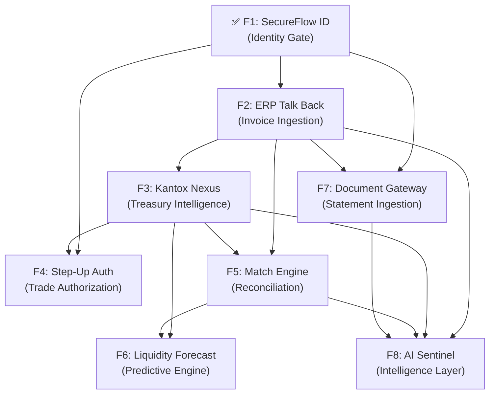

# Nexus Feature Roadmap

> Reference this alongside [feature-development.md](file:///Users/bernard/dev/nexus/.agent/workflows/feature-development.md) when starting any feature.
> **Rule: No feature may begin until all its prerequisites are marked ✅.**

---

## Progress Tracker

- [x] **F1: SecureFlow ID** — Identity Gate (WebAuthn biometric auth)
- [ ] **F2: ERP Talk Back** — Invoice Ingestion Engine
- [ ] **F3: Kantox Nexus** — Treasury Intelligence Dashboard
- [ ] **F4: Step-Up Auth** — Biometric trade authorization (>€100k)
- [ ] **F5: Match Engine** — Automated reconciliation
- [ ] **F6: Liquidity Forecast** — Predictive engine (Nx)
- [ ] **F7: Document Gateway** — Statement/CSV/MT940 upload
- [ ] **F8: AI Sentinel** — Anomaly detection + sentiment analysis

---

## Dependency Graph



---

## Recommended Build Order

```
Session 1-4    → F2: ERP Talk Back (unblocks everything)
Session 5-11   → F3: Kantox Nexus + Dashboard Overhaul
Session 12-13  → F4: Step-Up Authorization
Session 14-16  → F7: Document Gateway
Session 17-20  → F5: Match Engine + Process Manager
Session 21-25  → F6: Liquidity Forecasting + Nx
Session 26-33  → F8: AI Sentinel
```

---

## Feature 1: SecureFlow ID — ✅ COMPLETE

> Password-less, hardware-backed biometric authentication

**Domain:** `Identity` · **Aggregate:** `User`

**Existing files:**

- Aggregate: `lib/nexus/identity/aggregates/user.ex`
- Commands: `commands/register_user.ex`, `commands/verify_biometric.ex`
- Events: `events/user_registered.ex`, `events/biometric_verified.ex`
- Projection: `projections/user.ex` · Projector: `projectors/user_projector.ex`
- ETS: `auth_challenge_store.ex` · WebAuthn: `webauthn.ex`
- LiveView: `live/identity/biometric_live.ex` + `biometric_components.ex`
- JS Hook: `assets/js/hooks/webauthn.js`
- BDD: 3 feature files, 3 test modules — all passing

---

## Feature 2: ERP "Talk Back" Ingestion Engine

> **Domain:** `ERP` · **Aggregate:** `Invoice` · **Prerequisite:** F1 ✅

### What Exists

- `lib/nexus/erp/adapters/sap_adapter.ex` — mock Finch enrichment call
- `lib/nexus/erp/adapters/rate_limiter.ex` — Hammer 100 req/60s guard
- Empty `commands/` and `events/` dirs

### New Dependencies

| Dep         | Purpose              | Status            |
| ----------- | -------------------- | ----------------- |
| `finch`     | HTTP/2 pooled client | ✅ In mix.exs     |
| `hammer`    | Rate limiting        | ✅ In mix.exs     |
| `sweet_xml` | Legacy SOAP parsing  | ⬜ Add to mix.exs |

### Artifacts to Build

| Phase    | Artifact    | File                                             |
| -------- | ----------- | ------------------------------------------------ |
| 1 BDD    | Feature     | `test/features/erp/invoice_ingestion.feature`    |
| 1 BDD    | Feature     | `test/features/erp/rate_limiting.feature`        |
| 2 Domain | Command     | `lib/nexus/erp/commands/ingest_invoice.ex`       |
| 2 Domain | Event       | `lib/nexus/erp/events/invoice_ingested.ex`       |
| 2 Domain | Event       | `lib/nexus/erp/events/invoice_rejected.ex`       |
| 2 Domain | Aggregate   | `lib/nexus/erp/aggregates/invoice.ex`            |
| 2 Domain | Projection  | `lib/nexus/erp/projections/invoice.ex`           |
| 2 Domain | Migration   | `priv/repo/migrations/*_create_erp_invoices.exs` |
| 2 Domain | Projector   | `lib/nexus/erp/projectors/invoice_projector.ex`  |
| 2 Domain | Router      | Add `IngestInvoice` to `lib/nexus/router.ex`     |
| 3 Test   | Test module | `test/nexus/erp/invoice_ingestion_test.exs`      |
| 3 Test   | Test module | `test/nexus/erp/rate_limiting_test.exs`          |
| 4 Web    | Route       | `live "/invoices", ERP.InvoiceLive`              |
| 4 Web    | LiveView    | `lib/nexus_web/live/erp/invoice_live.ex`         |
| 4 Web    | Components  | `lib/nexus_web/live/erp/invoice_components.ex`   |

### BDD Scenarios

1. SAP webhook → talk-back → invoice enriched → `InvoiceIngested` emitted
2. Rate limit exceeded → graceful retry → no blacklist
3. Invalid SAP payload → `InvoiceRejected` event
4. Duplicate invoice ID → idempotent rejection

### Key Command Fields

```elixir
defstruct [:invoice_id, :entity_id, :currency, :amount, :subsidiary, :line_items, :sap_document_number]
```

### Aggregate Invariants

- Reject duplicate `invoice_id` (idempotency)
- Validate `amount` is positive via `Decimal`
- Must have at least 1 line item

---

## Feature 3: Kantox Nexus — Treasury Intelligence

> **Domain:** `Treasury` · **Aggregate:** `Exposure` · **Prerequisites:** F1 ✅, F2

### What Exists

- `lib/nexus/treasury/gateways/price_cache.ex` — ETS O(1) rate store
- Empty `aggregates/`, `commands/`, `events/`, `projections/`, `projectors/`
- Placeholder `lib/nexus_web/live/dashboard_live.ex`

### New Dependencies

| Dep            | Purpose             | Status           |
| -------------- | ------------------- | ---------------- |
| `websockex`    | WebSocket client    | ✅ In mix.exs    |
| `timescale`    | Hypertables         | ✅ In mix.exs    |
| `decimal`      | Financial precision | ✅ In mix.exs    |
| Apache ECharts | Canvas charts       | ⬜ Vendor via JS |

### Artifacts to Build

| Phase    | Artifact     | File                                                     |
| -------- | ------------ | -------------------------------------------------------- |
| 1 BDD    | Feature      | `test/features/treasury/market_data_feed.feature`        |
| 1 BDD    | Feature      | `test/features/treasury/exposure_calculation.feature`    |
| 2 Domain | Command      | `lib/nexus/treasury/commands/calculate_exposure.ex`      |
| 2 Domain | Command      | `lib/nexus/treasury/commands/record_market_tick.ex`      |
| 2 Domain | Event        | `lib/nexus/treasury/events/exposure_calculated.ex`       |
| 2 Domain | Event        | `lib/nexus/treasury/events/market_tick_recorded.ex`      |
| 2 Domain | Aggregate    | `lib/nexus/treasury/aggregates/exposure.ex`              |
| 2 Domain | Projection   | `lib/nexus/treasury/projections/market_tick.ex`          |
| 2 Domain | Projection   | `lib/nexus/treasury/projections/exposure_snapshot.ex`    |
| 2 Domain | Migration    | `*_create_market_ticks.exs` (Hypertable)                 |
| 2 Domain | Migration    | `*_create_exposure_snapshots.exs`                        |
| 2 Domain | Projector    | `lib/nexus/treasury/projectors/market_tick_projector.ex` |
| 2 Domain | Projector    | `lib/nexus/treasury/projectors/exposure_projector.ex`    |
| 2 Domain | Gateway      | `lib/nexus/treasury/gateways/polygon_client.ex`          |
| 2 Domain | Router       | Add dispatches to `lib/nexus/router.ex`                  |
| 3 Test   | Test modules | `test/nexus/treasury/market_data_feed_test.exs`          |
| 3 Test   | Test modules | `test/nexus/treasury/exposure_calculation_test.exs`      |
| 4 Web    | LiveView     | `lib/nexus_web/live/treasury/dashboard_live.ex`          |
| 4 Web    | Components   | `lib/nexus_web/live/treasury/dashboard_components.ex`    |
| 4 Web    | JS Hook      | `assets/js/hooks/echarts.js`                             |

### Key UI Elements

- Candlestick chart (EUR/USD) via ECharts
- Exposure heatmap by subsidiary
- Real-time tick feed (PubSub → LiveView)
- "Stale Data" amber warning (>15min no tick)

> **NOTE:** Replaces placeholder `dashboard_live.ex` with real treasury command center

---

## Feature 4: Step-Up Authorization

> **Domain:** `Identity` (extends) · **Prerequisites:** F1 ✅, F3

### Artifacts to Build

| Phase    | Artifact    | File                                                   |
| -------- | ----------- | ------------------------------------------------------ |
| 1 BDD    | Feature     | `test/features/identity/step_up_authorization.feature` |
| 2 Domain | Command     | `lib/nexus/identity/commands/authorize_step_up.ex`     |
| 2 Domain | Event       | `lib/nexus/identity/events/step_up_authorized.ex`      |
| 2 Domain | Event       | `lib/nexus/identity/events/step_up_rejected.ex`        |
| 2 Domain | Aggregate   | Extend `User` with step-up `execute/2` clause          |
| 3 Test   | Test module | `test/nexus/identity/step_up_authorization_test.exs`   |
| 4 Web    | Component   | Step-up modal (reuses sensor ring from F1)             |

### BDD Scenarios

1. Trade >€100k → biometric challenge issued → authorized
2. Trade ≤€100k → auto-authorized without biometric
3. Step-up challenge expired → trade rejected

---

## Feature 5: Match Engine — Reconciliation

> **Domain:** `Treasury` (extends) · **Prerequisites:** F2, F3

### Artifacts to Build

| Phase    | Artifact        | File                                                                 |
| -------- | --------------- | -------------------------------------------------------------------- |
| 1 BDD    | Feature         | `test/features/treasury/reconciliation.feature`                      |
| 2 Domain | Command         | `lib/nexus/treasury/commands/reconcile_transaction.ex`               |
| 2 Domain | Events          | `events/transaction_reconciled.ex`, `events/settlement_unmatched.ex` |
| 2 Domain | Aggregate       | `lib/nexus/treasury/aggregates/reconciliation.ex`                    |
| 2 Domain | Projection      | `lib/nexus/treasury/projections/reconciliation.ex`                   |
| 2 Domain | Projector       | `lib/nexus/treasury/projectors/reconciliation_projector.ex`          |
| 2 Domain | Process Mgr     | `lib/nexus/treasury/process_managers/reconciliation_manager.ex`      |
| 3 Test   | Test module     | `test/nexus/treasury/reconciliation_test.exs`                        |
| 4 Web    | Dashboard panel | Reconciliation view + unmatched queue                                |

> **NOTE:** First feature requiring a Commanded Process Manager

---

## Feature 6: Liquidity Forecasting

> **Domain:** `Treasury` (extends) · **Prerequisites:** F3, F5

### New Dependencies

| Dep       | Purpose          |
| --------- | ---------------- |
| `nx`      | Numerical Elixir |
| `scholar` | ML algorithms    |

### Artifacts to Build

| Phase    | Artifact | File                                               |
| -------- | -------- | -------------------------------------------------- |
| 2 Domain | Command  | `lib/nexus/treasury/commands/generate_forecast.ex` |
| 2 Domain | Event    | `lib/nexus/treasury/events/forecast_generated.ex`  |
| 2 Domain | Service  | `lib/nexus/treasury/services/forecast_engine.ex`   |
| 4 Web    | Chart    | Forecast area chart (ECharts, confidence bands)    |

---

## Feature 7: Document Gateway

> **Domain:** `ERP` (extends) · **Prerequisites:** F1 ✅, F2

### New Dependencies

| Dep          | Purpose                   |
| ------------ | ------------------------- |
| `oban`       | Background job processing |
| `nimble_csv` | CSV parsing               |

### Artifacts to Build

| Phase    | Artifact    | File                                                           |
| -------- | ----------- | -------------------------------------------------------------- |
| 1 BDD    | Feature     | `test/features/erp/statement_upload.feature`                   |
| 2 Domain | Command     | `lib/nexus/erp/commands/upload_statement.ex`                   |
| 2 Domain | Events      | `events/statement_uploaded.ex`, `events/statement_rejected.ex` |
| 2 Domain | Aggregate   | `lib/nexus/erp/aggregates/statement.ex`                        |
| 2 Domain | Projection  | `lib/nexus/erp/projections/statement.ex`                       |
| 2 Domain | Projector   | `lib/nexus/erp/projectors/statement_projector.ex`              |
| 2 Domain | Parser      | `lib/nexus/erp/services/statement_parser.ex`                   |
| 3 Test   | Test module | `test/nexus/erp/statement_upload_test.exs`                     |
| 4 Web    | LiveView    | `lib/nexus_web/live/erp/statement_live.ex`                     |
| 4 Web    | Components  | `lib/nexus_web/live/erp/statement_components.ex`               |

---

## Feature 8: AI Sentinel

> **Domain:** `Intelligence` (new) · **Prerequisites:** F2, F3, F5, F7

### New Dependencies

| Dep          | Purpose               |
| ------------ | --------------------- |
| `bumblebee`  | HuggingFace models    |
| `instructor` | Structured LLM output |
| `exla`       | GPU/CPU acceleration  |

### Artifacts to Build

| Phase    | Artifact  | File                                                       |
| -------- | --------- | ---------------------------------------------------------- |
| 2 Domain | Command   | `lib/nexus/intelligence/commands/analyze_invoice.ex`       |
| 2 Domain | Command   | `lib/nexus/intelligence/commands/analyze_sentiment.ex`     |
| 2 Domain | Events    | `events/anomaly_detected.ex`, `events/sentiment_scored.ex` |
| 2 Domain | Aggregate | `lib/nexus/intelligence/aggregates/analysis.ex`            |
| 2 Domain | Service   | `services/anomaly_detector.ex`                             |
| 2 Domain | Service   | `services/sentiment_analyzer.ex`                           |
| 2 Domain | Service   | `services/document_extractor.ex`                           |
| 4 Web    | LiveView  | `lib/nexus_web/live/intelligence/analysis_live.ex`         |

---

## Cumulative Infrastructure Additions

### mix.exs — New Dependencies

| Feature | Dependency   | Version   |
| ------- | ------------ | --------- |
| F2      | `sweet_xml`  | `~> 0.7`  |
| F6      | `nx`         | `~> 0.9`  |
| F6      | `scholar`    | `~> 0.3`  |
| F7      | `oban`       | `~> 2.18` |
| F7      | `nimble_csv` | `~> 1.2`  |
| F8      | `bumblebee`  | `~> 0.6`  |
| F8      | `instructor` | `~> 0.1`  |
| F8      | `exla`       | `~> 0.9`  |

### application.ex — Supervisor Additions

| Feature | Child                                                  |
| ------- | ------------------------------------------------------ |
| F3      | `Nexus.Treasury.Gateways.PolygonClient`                |
| F3      | `Nexus.Treasury.Projectors.MarketTickProjector`        |
| F3      | `Nexus.Treasury.Projectors.ExposureProjector`          |
| F5      | `Nexus.Treasury.ProcessManagers.ReconciliationManager` |
| F7      | `{Oban, oban_config()}`                                |
| F8      | `Nexus.Intelligence.Services.SentimentAnalyzer`        |

### Web Router — New Routes

| Feature | Route                                             | LiveView                |
| ------- | ------------------------------------------------- | ----------------------- |
| F2      | `live "/invoices", ERP.InvoiceLive`               | Invoice feed            |
| F3      | (replaces `/dashboard`)                           | Treasury command center |
| F7      | `live "/statements", ERP.StatementLive`           | Upload gateway          |
| F8      | `live "/intelligence", Intelligence.AnalysisLive` | AI panel                |

### Commanded Router — New Dispatches

| Feature | Command → Aggregate                       |
| ------- | ----------------------------------------- |
| F2      | `IngestInvoice` → `Invoice`               |
| F3      | `CalculateExposure` → `Exposure`          |
| F4      | `AuthorizeStepUp` → `User`                |
| F5      | `ReconcileTransaction` → `Reconciliation` |
| F7      | `UploadStatement` → `Statement`           |
| F8      | `AnalyzeInvoice` → `Analysis`             |
