# Nexus Feature Playbook — The Mental Model

> **This is the cockpit checklist.** Before touching any code, read this page.
> It tells you _how to think_, not just what to do.

---

## The Four Bibles & When to Open Each

| Doc                                                                                                   | What It Answers                         | When to Open                         |
| ----------------------------------------------------------------------------------------------------- | --------------------------------------- | ------------------------------------ |
| [nexus-feature-roadmap.md](file:///Users/bernard/dev/nexus/.agent/workflows/nexus-feature-roadmap.md) | **What** to build next + prerequisites  | Phase 0 — before starting anything   |
| [nexus-db-schema.md](file:///Users/bernard/dev/nexus/.agent/workflows/nexus-db-schema.md)             | **Where** data lives + table shapes     | Phase 2 — when building domain layer |
| [feature-development.md](file:///Users/bernard/dev/nexus/.agent/workflows/feature-development.md)     | **How** to build it (step-by-step code) | Phase 1–7 — the entire build loop    |
| [nexus-ux-flow.md](file:///Users/bernard/dev/nexus/.agent/workflows/nexus-ux-flow.md)                 | **What it looks like** to the user      | Phase 4–5 — web layer + polish       |

---

## The Loop — How a Feature Gets Done

```mermaid
graph TD
    P0["🔍 PHASE 0\nPick & Scope"] --> P1["📝 PHASE 1\nWrite the .feature"]
    P1 --> P2["⚙️ PHASE 2\nDomain Layer"]
    P2 --> GATE1{"mix compile\n--warnings-as-errors"}
    GATE1 -->|pass| P3["🧪 PHASE 3\nWire Tests"]
    GATE1 -->|fail| P2
    P3 --> GATE2{"mix test.features"}
    GATE2 -->|pass| P4["🖥️ PHASE 4\nWeb Layer"]
    GATE2 -->|fail| P3
    P4 --> GATE3{"compile + render"}
    GATE3 -->|pass| P5["✨ PHASE 5\nUI Polish"]
    GATE3 -->|fail| P4
    P5 --> P6["✅ PHASE 6\nFull Verify"]
    P6 --> GATE4{"all tests + browser"}
    GATE4 -->|pass| P7["📦 PHASE 7\nCommit"]
    GATE4 -->|fail| P5
```



---

## Phase 0 — Pick & Scope (5 min)

**Mental rule:** _"I will not write code until I can say what command, event, and page this feature produces."_

1. Open **roadmap** → find the next unchecked feature
2. Verify all prerequisites are ✅ (hard stop if not)
3. Open the feature's detailed spec in the roadmap (commands, events, tables, pages)
4. State the "one-liner": _"F2 adds `IngestInvoice` command → `InvoiceIngested` event → `invoices` table → `/invoices` page"_

**You leave Phase 0 knowing:** domain, aggregate, command(s), event(s), table(s), page(s).

---

## Phase 1 — Write the Spec First (10 min)

**Mental rule:** _"The .feature file is the contract. If I can't describe it in Given/When/Then, I don't understand it yet."_

1. Create `test/features/<domain>/<feature_name>.feature`
2. Write happy path scenario
3. Write at least one failure/edge case scenario
4. Use **business language** from the UX glossary (check `nexus-ux-flow.md`)

**Gate:** The `.feature` reads like plain English a treasurer could understand.

---

## Phase 2 — Build the Domain (30–60 min)

**Mental rule:** _"Commands → Events → Aggregate → Projection → Projector → Router. Always this order."_

1. Open **db-schema** → find the table definition for this feature
2. Open **feature-development** → follow Phase 2 steps 2.1–2.6 exactly
3. Create files in strict order:
   - `commands/<verb_noun>.ex` — plain struct, no logic
   - `events/<noun_past_tense>.ex` — `@derive Jason.Encoder`, immutable fact
   - `aggregates/<noun>.ex` — `execute/2` returns events, `apply/2` mutates state
   - `projections/<noun>.ex` — Ecto schema matching db-schema doc
   - `projectors/<noun>_projector.ex` — listens for events, writes to Postgres
   - `router.ex` — register the dispatch
4. Create migration: `mix ecto.gen.migration create_<table>`

**Gate:** `mix compile --warnings-as-errors` → 0 errors, 0 warnings.

---

## Phase 3 — Wire the Tests (20 min)

**Mental rule:** _"Every Given/When/Then in the .feature must have a matching defgiven/defwhen/defthen. No orphans."_

1. Create `test/nexus/<domain>/<feature>_test.exs`
2. Follow **feature-development** Phase 3 patterns exactly
3. Start projectors in `setup` block
4. Use retry loops for async projections

**Gate:** `mix test.features` → all green.

---

## Phase 4 — Build the Web Layer (30–60 min)

**Mental rule:** _"Route → LiveView → Components → Hooks. The user never sees a technical name."_

1. Open **ux-flow** → find the page spec for this feature
2. Follow **feature-development** Phase 4 steps 4.1–4.4
3. Check the **copy glossary** — replace every internal term with user-facing language
4. Use shared components from `NexusComponents` (`dark_page`, `dark_card`, etc.)

**Gate:** `mix compile --warnings-as-errors` + page renders in browser.

---

## Phase 5 — Polish (15 min)

**Mental rule:** _"Would a Goldman Sachs treasurer be impressed by this screen?"_

1. Run through the **ux-flow** checklist for that page
2. Check all states (idle, loading, success, error)
3. Remove any debug info, raw IDs, technical jargon
4. Verify copy matches the glossary exactly

**Gate:** Screenshots of every state look premium.

---

## Phase 6 — Full Verification (5 min)

**Mental rule:** _"If CI would fail, I failed."_

```bash
mix compile --warnings-as-errors  # zero warnings
mix format --check-formatted       # formatting clean
mix test.features                  # BDD scenarios pass
mix test                           # no regressions
```

Then browser walkthrough: happy path + one error path.

**Gate:** All four commands pass. Browser works.

---

## Phase 7 — Commit & Update (5 min)

**Mental rule:** _"The roadmap and schema doc must reflect reality."_

1. Update **roadmap** → mark feature as ✅
2. Update **db-schema** → mark table as "✅ Exists"
3. Commit with conventional message: `feat(<domain>): <description>`
4. Push and verify CI passes

---

## Cheat Sheet — One Line Per Phase

| Phase     | One-liner                                                            | Time      |
| --------- | -------------------------------------------------------------------- | --------- |
| 0. Scope  | _"I know the command, event, table, and page."_                      | 5 min     |
| 1. Spec   | _"The .feature file is my contract."_                                | 10 min    |
| 2. Domain | _"Commands → Events → Aggregate → Projection → Projector → Router."_ | 30-60 min |
| 3. Tests  | _"Every step has a matching def."_                                   | 20 min    |
| 4. Web    | _"Route → LiveView → Components. No jargon."_                        | 30-60 min |
| 5. Polish | _"Would a treasurer be impressed?"_                                  | 15 min    |
| 6. Verify | _"If CI would fail, I failed."_                                      | 5 min     |
| 7. Commit | _"Roadmap and schema doc match reality."_                            | 5 min     |

---

## Anti-Patterns — Things That Break the Loop

| ❌ Don't                            | ✅ Do Instead                                     |
| ----------------------------------- | ------------------------------------------------- |
| Skip the `.feature` file            | Write spec first — it catches design gaps         |
| Build UI before domain              | Domain layer compiles → tests pass → then web     |
| Show "EventName" to users           | Check the copy glossary in `nexus-ux-flow.md`     |
| Create tables not in db-schema      | Add to `nexus-db-schema.md` first                 |
| Start a feature with unmet prereqs  | Check roadmap dependency graph first              |
| Push without `mix format`           | Run format check before every commit              |
| Hardcode email/role on registration | Use struct defaults — frictionless auth           |
| Add RBAC tables                     | Role is a string on `users` — isolate in app code |
| Swallowing projector errors         | Allow Commanded to handle projection failures     |
