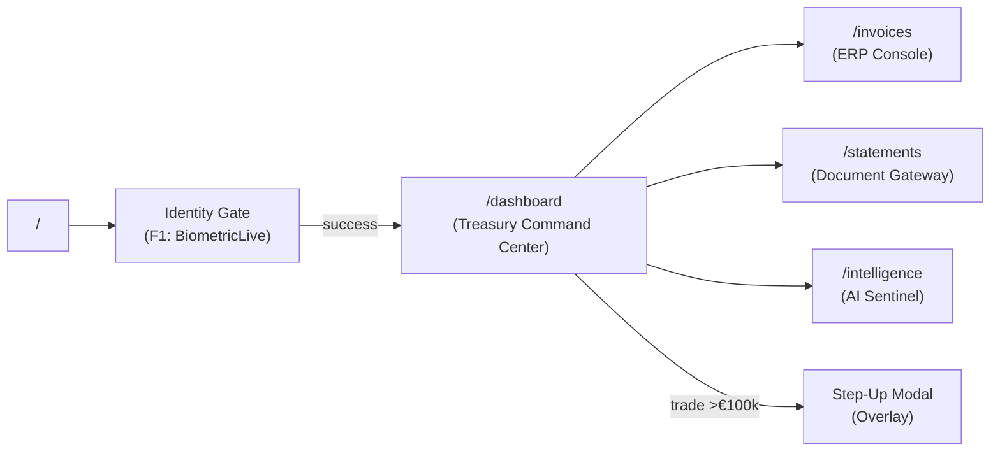
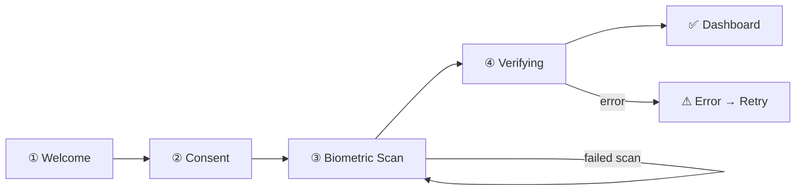
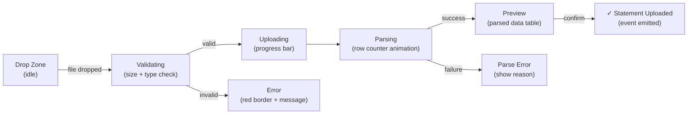
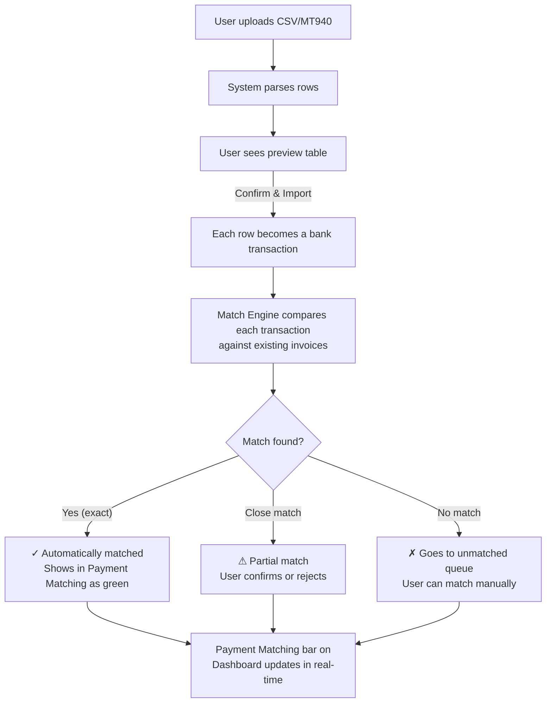
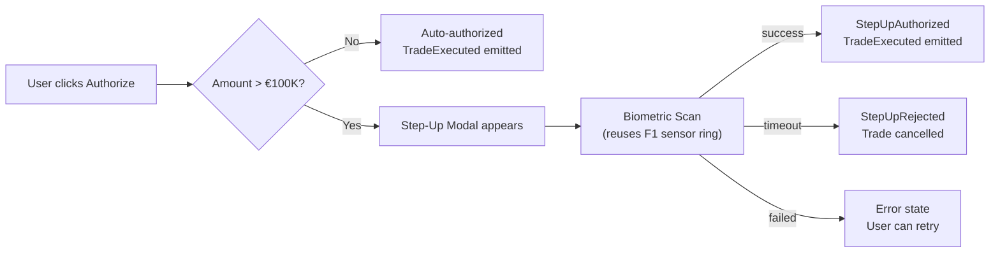

# Nexus UX Flow — Complete User Journey

> **This document is the design bible.** Every screen, every interaction, every state, and every transition is defined here. A designer given this document can build the entire application without ambiguity.

---

## Table of Contents

1. [Design System & Principles](#1-design-system--principles)
2. [Site Map & Navigation](#2-site-map--navigation)
3. [Page 1: Identity Gate — Authentication](#3-page-1-identity-gate--authentication)
4. [Page 2: Dashboard](#4-page-2-dashboard)
5. [Page 3: Your Invoices](#5-page-3-your-invoices)
6. [Page 4: Upload Bank Statement](#6-page-4-upload-bank-statement)
7. [Page 5: Smart Insights](#7-page-5-smart-insights)
8. [Overlay: Confirm Your Identity Modal](#8-overlay-confirm-your-identity-modal)
9. [Global Patterns & Micro-interactions](#9-global-patterns--micro-interactions)
10. [External API Integration Points](#10-external-api-integration-points)
11. [Error States & Edge Cases](#11-error-states--edge-cases)

---

## 1. Design System & Principles

### Visual Identity

| Token          | Value             | Purpose                         |
| -------------- | ----------------- | ------------------------------- |
| Background     | `#0B0E13`         | App-wide dark base              |
| Card Surface   | `#14181F`         | Elevated containers             |
| Border         | `white/[0.06]`    | Subtle depth separation         |
| Primary Accent | Indigo `#6366F1`  | Actions, active states, links   |
| Success        | Emerald `#10B981` | Confirmations, positive changes |
| Warning        | Amber `#F59E0B`   | Stale data, attention needed    |
| Danger         | Rose `#F43F5E`    | Errors, critical alerts, losses |
| Text Primary   | `white`           | Headlines                       |
| Text Secondary | `slate-400`       | Descriptions, metadata          |
| Text Muted     | `slate-600`       | Hints, timestamps               |

### Typography

- Headlines: `tracking-tight font-bold` — clean, authoritative
- Body text: `text-sm` — readable, not overwhelming
- Data labels: `text-[10px] uppercase tracking-[0.2em]` — institutional aesthetic
- Monospace: `font-mono` — used for IDs, prices, hashes

### Component Library (Shared)

| Component         | Description                               | Used In                  |
| ----------------- | ----------------------------------------- | ------------------------ |
| `dark_page`       | Full-page dark container                  | Every page               |
| `dark_card`       | Rounded card with subtle border           | Dashboard, panels        |
| `asset_item`      | Currency pair row (name, price, change %) | Dashboard sidebar        |
| `sensor_ring`     | Biometric fingerprint scanner             | Auth (F1), Step-up (F4)  |
| `step_indicators` | Progress dots (4 steps)                   | Auth flow                |
| `security_badge`  | "AES-256 · HSM" trust label               | Auth, high-value actions |

### Design Principles

1. **Zero-trust aesthetic** — security indicators always visible
2. **Data density over simplicity** — treasurers want information, not minimalism
3. **Real-time feeling** — pulse animations, streaming numbers, live timestamps
4. **Institutional tone** — dark, restrained, precise — never playful or casual

### User-Facing Copy Glossary

> **RULE:** Never show the internal/technical name to the user. Always use the user-facing copy below. The technical names are for developer reference only.

| Internal / Technical Name                          | User-Facing Label (what the user sees)      |
| -------------------------------------------------- | ------------------------------------------- |
| Identity Gate / SecureFlow ID                      | **"Sign In"** or **"Verify Your Identity"** |
| Treasury Command Center                            | **"Dashboard"**                             |
| ERP Talk Back / Invoice Console                    | **"Your Invoices"**                         |
| Document Gateway / Secure Statement Ingestion      | **"Upload Bank Statement"**                 |
| AI Sentinel / Anomaly Detection & Market Sentiment | **"Smart Insights"**                        |
| Step-Up Authorization                              | **"Confirm Your Identity"**                 |
| Liquidity Forecast                                 | **"Cash Flow Outlook"**                     |
| Reconciliation Engine / Match Engine               | **"Payment Matching"**                      |
| Exposure Heatmap                                   | **"Risk Overview"**                         |
| Market Overview                                    | **"Market Prices"**                         |
| Positions                                          | **"Your Currencies"**                       |
| Exposure Summary                                   | **"Your Risk at a Glance"**                 |
| VaR (95%)                                          | **"Maximum Expected Loss"**                 |
| Candlestick Chart                                  | **"Price Chart"**                           |
| InvoiceIngested                                    | **"New invoice received"**                  |
| InvoiceEnriched                                    | **"Invoice details loaded"**                |
| InvoiceRejected                                    | **"Invoice could not be processed"**        |
| TransactionReconciled                              | **"Payment matched to invoice"**            |
| SettlementUnmatched                                | **"Payment not yet matched"**               |
| ForecastGenerated                                  | **"Cash flow forecast updated"**            |
| AnomalyDetected                                    | **"Something looks unusual"**               |
| StepUpAuthorized                                   | **"Identity confirmed"**                    |
| StepUpRejected                                     | **"Confirmation failed"**                   |
| MarketTickRecorded                                 | **"Price updated"**                         |
| Stale Data                                         | **"Prices may be outdated"**                |
| Rate-Limited                                       | **"Waiting — too many requests"**           |
| WebAuthn / FIDO2                                   | **"fingerprint" or "security key"**         |
| PubSub                                             | _(never shown to user)_                     |
| ETS / GenServer                                    | _(never shown to user)_                     |

---

## 2. Site Map & Navigation

### Route Map



### Primary Navigation — Sidebar

After authentication, a persistent left sidebar provides navigation:

```
┌─────────────────────────────────┐
│  ◆ NEXUS                    │  ← Logo + wordmark
│                             │
│  ━━━━━━━━━━━━━━━━━━━━━━━━━  │
│                             │
│  ◉  Dashboard               │  ← /dashboard (F3)
│  ☰  Your Invoices           │  ← /invoices  (F2)
│  ↑  Upload Statements       │  ← /statements (F7)
│  ◈  Smart Insights          │  ← /intelligence (F8)
│                             │
│  ━━━━━━━━━━━━━━━━━━━━━━━━━  │
│                             │
│  ● Identity Verified        │  ← Session status (green pulse)
│  Session: 3F8A...           │  ← Truncated session ID
│  🔒 Secured · Encrypted      │  ← Trust footer
└─────────────────────────────┘
```

**Sidebar Behaviour:**

- Collapsed on mobile (hamburger)
- Active page highlighted with indigo left-border accent
- Session status always visible at bottom
- Trust indicators anchored to sidebar footer

---

## 3. Page 1: Identity Gate — Authentication

> **Route:** `/` · **Feature:** F1 (SecureFlow ID) · **Status:** ✅ Built

### Entry Point

This is the FIRST thing any user sees. No content is accessible without biometric authentication.

### Flow: 4-Step Wizard



---

#### Step 1: Welcome

**What the user sees:**

- Shield icon in indigo container
- Headline: "Nexus Identity Verification"
- Subtext: "Hardware-secured biometric authentication to access your treasury command center."
- Three feature items with icons:
  - 🛡 "Passkey-grade security" — "WebAuthn hardware binding"
  - ⚡ "Instant verification" — "Single-touch biometric scan"
  - 🔐 "Zero-knowledge proof" — "Your biometric never leaves the device"
- Primary CTA: "Begin identity verification →"
- Footer: 🔒 "Nexus encrypted session · end-to-end"

**User Action:** Tap "Begin identity verification" → navigates to Step 2

---

#### Step 2: Consent

**What the user sees:**

- Scale icon in indigo container
- Headline: "Data Processing Consent"
- Subtext: "Review and accept the data handling terms before proceeding."
- Scrollable consent text covering:
  - Biometric data processing
  - GDPR + CCPA compliance
  - Data retention policy
- Checkbox: "I consent to the processing of my biometric data..."
- Primary CTA: "Continue to biometric scan →" (disabled until checkbox is checked)

**User Action:** Check consent → CTA becomes active → tap to proceed to Step 3

**Interaction Detail:**

- Checkbox toggles `consent_checked` assign
- Button is visually disabled (opacity-50) when unchecked
- Smooth enable animation when checked

---

#### Step 3: Biometric Scan

**What the user sees:**

- Central fingerprint sensor ring (192×192px)
- Outer ring (256×256px) with subtle glow
- Progress ring (SVG circle, `stroke-dashoffset` animated)
- Hint text below: "Press and hold the sensor"
- Verification ID badge: "KYC-XXXXXXX"

**States & Visual Feedback:**

| State    | Ring Color         | Icon                   | Hint Text                     | Animation                    |
| -------- | ------------------ | ---------------------- | ----------------------------- | ---------------------------- |
| Idle     | `white/5` border   | Fingerprint (slate)    | "Press and hold the sensor"   | None                         |
| Scanning | `indigo-500` glow  | Fingerprint (indigo)   | "Scanning... hold steady"     | Scan beam sweeps, ring fills |
| Success  | `emerald-500` glow | Shield-check (emerald) | "Biometric captured"          | Ring completes, pulse effect |
| Error    | `amber-500` glow   | Fingerprint (amber)    | "Scan incomplete — try again" | Shake animation              |

**User Action:**

- Touch/click & hold the sensor → scanning begins
- Progress ring fills over ~2 seconds of hold
- Release before complete → Error state → retry cooldown (2s)
- Hold until complete → WebAuthn `navigator.credentials.create()` fires
- Browser native biometric prompt appears (TouchID / Windows Hello / Security Key)
- On success → transition to Step 4

**Technical Hooks (JS):**

- `pointerdown` → start scan, push `biometric_start` event to LiveView
- `pointerup` / `pointerleave` → if progress < 100%, abort + show retry
- `finishScan()` → WebAuthn credential creation → push `biometric_complete` with attestation

---

#### Step 4: Verifying (Auto-advance)

**What the user sees:**

- Headline: "Verifying Identity"
- Subtext: "Running compliance checks..."
- Three screening items with animated status:
  1. "Fuzzy Match Screening" — scanning → ✓ passed (after 800ms)
  2. "OFAC Sanctions Check" — scanning → ✓ clear (after 2000ms)
  3. "PEP Risk Assessment" — scanning → ✓ low risk (after 3000ms)

**Auto-transition:** After all 3 checks pass → 1.5s pause → `push_navigate` to `/dashboard`

**User sees NO button on this step** — it's fully automated. This communicates institutional rigor.

---

### Error Recovery

If WebAuthn fails (hardware mismatch, user cancels browser prompt):

- LiveView receives `biometric_reset` with error message
- UI returns to Step 3 idle state
- Error message displayed below sensor: "Verification failed — [reason]"
- User can retry immediately

---

## 4. Page 2: Dashboard

> **Route:** `/dashboard` · **Features:** F3 (Kantox Nexus) + F5 (Match Engine) + F6 (Liquidity Forecast)
> **User sees:** Page title = **"Dashboard"** — no mention of "Treasury Command Center" or "Kantox"

### Layout

```
┌──────────────────────────────────────────────────────────────────┐
│  HEADER BAR                                                      │
│  "Dashboard"                        ● Identity Verified   [👤]   │
├──────────────────────────────────────────────────────────────────┤
│                                                                  │
│  ┌─────────────────────────────────┐  ┌───────────────────────┐  │
│  │  MARKET PRICES                  │  │  YOUR CURRENCIES      │  │
│  │  ┌───────────────────────────┐  │  │  EUR/USD  1.0842 +0.2%│  │
│  │  │                           │  │  │  GBP/USD  1.2641 -0.1%│  │
│  │  │   Price Chart              │  │  │  USD/JPY  154.32 +0.4%│  │
│  │  │   (ECharts · Canvas)      │  │  │  CHF/USD  0.8891 -0.3%│  │
│  │  │                           │  │  │                       │  │
│  │  │   ⚠ Prices may be up to   │  │  │  ─────────────────    │  │
│  │  │     15 minutes behind     │  │  │  YOUR RISK AT A GLANCE│  │
│  │  └───────────────────────────┘  │  │  Total: €4.2M         │  │
│  │  [EUR/USD ▼] [1H][4H][1D][1W]  │  │  At Risk: €340K       │  │
│  └─────────────────────────────────┘  │  Max Loss: €89K       │  │
│                                       └───────────────────────┘  │
│  ┌─────────────────────────────────┐  ┌───────────────────────┐  │
│  │  RISK OVERVIEW                 │  │  RECENT ACTIVITY       │  │
│  │  ┌───────────────────────────┐ │  │                       │  │
│  │  │ [Office × Currency]       │ │  │  10:42 New invoice     │  │
│  │  │  Color = risk intensity   │ │  │  10:38 Price updated   │  │
│  │  │  Click = see invoices     │ │  │  10:35 Payment matched │  │
│  │  └───────────────────────────┘ │  │  10:22 Forecast ready  │  │
│  └─────────────────────────────────┘  └───────────────────────┘  │
│                                                                  │
│  ┌───────────────────────────────────────────────────────────┐   │
│  │  CASH FLOW OUTLOOK (30-DAY)                                │  │
│  │  ┌────────────────────────────────────────────────────┐    │  │
│  │  │  Area chart with confidence bands                  │    │  │
│  │  │  Upper band (95%), median projection, lower band   │    │  │
│  │  │  ▲ Cash gap alerts marked as vertical red lines    │    │  │
│  │  └────────────────────────────────────────────────────┘    │  │
│  │  [7D] [14D] [30D]      Last updated: 10:45 UTC            │  │
│  └───────────────────────────────────────────────────────────┘   │
│                                                                  │
│  ┌───────────────────────────────────────────────────────────┐   │
│  │  PAYMENT MATCHING                                          │  │
│  │  Matched: 847 (94.2%)  │  Partial: 38  │  Unmatched: 15   │  │
│  │  [View All Payments →]                                     │  │
│  └───────────────────────────────────────────────────────────┘   │
└──────────────────────────────────────────────────────────────────┘
```

### Dashboard Sections — Detailed Specifications

---

#### Section A: Header Bar

**Elements:**

- Page title: **"Dashboard"** (NOT "Institutional Dashboard")
- Session ID: `Session: 3F8A...` (truncated, no hex prefix jargon)
- **"Identity Verified"** badge (emerald pulse dot, always visible) — NOT "Biometric Verified"
- User avatar circle (placeholder icon)

**Actions:** None — informational only

---

#### Section B: Market Prices Panel (F3)

**Data Source:** Polygon.io WebSocket → `PriceCache` ETS → PubSub → LiveView

**User sees section titled:** **"Market Prices"**

**Elements:**

- ECharts price chart (rendered via `phx-hook="EChartsHook"`)
- Pair selector dropdown: EUR/USD, GBP/USD, USD/JPY, etc.
- Timeframe tabs: 1H, 4H, 1D, 1W
- Stale data warning banner (amber): **"⚠ Prices may be up to 15 minutes behind"** (NOT "free tier" or "delayed data")
- Last tick timestamp: "Last update: 10:42:31 UTC"

**Interactions:**
| Action | Result |
|---|---|
| Select pair dropdown | Chart reloads with new pair data |
| Click timeframe tab | Chart zoom changes (re-query TimescaleDB) |
| Hover over candle | Tooltip: Open, High, Low, Close, Volume |
| No tick for >15min | Amber banner appears: "Stale Data — last tick 18 min ago" |

**Live Update Behaviour:**

- New ticks push to chart via LiveView `handle_info` → `push_event` → JS hook appends candle
- Price feed streams in sidebar simultaneously
- Green flash animation on price update

---

#### Section C: Your Currencies Sidebar

**User sees section titled:** **"Your Currencies"**

**Elements:**

- Currency pair rows using `asset_item` component
- Each row shows: pair name, current price, 24h change %
- Change % colored: green for positive, rose for negative
- Separator line
- **"Your Risk at a Glance"** summary box:
  - **Total:** aggregated from all ingested invoices (NOT "Total Exposure")
  - **At Risk:** invoices with unfavorable FX movement
  - **Max Expected Loss:** Value at Risk 95% (NOT "VaR (95%)")

**Interactions:**
| Action | Result |
|---|---|
| Click pair row | Market chart switches to that pair |
| Hover pair row | Subtle highlight, shows additional detail tooltip |

---

#### Section D: Risk Overview (F3)

**User sees section titled:** **"Risk Overview"**

**Data Source:** Invoice projections (F2) × Market rates (F3)

**Elements:**

- Grid visualization: rows = offices/subsidiaries, columns = currencies
- Cell color intensity = risk level (green → amber → rose)
- Cell value = amount in that currency for that office

**Interactions:**
| Action | Result |
|---|---|
| Click cell | Drill-down: shows invoices for that subsidiary+currency combo |
| Hover cell | Tooltip: exact amount, % of total exposure, time since last update |

---

#### Section E: Recent Activity Feed

**User sees section titled:** **"Recent Activity"**

**Data Source:** PubSub events from all domains

**Elements:**

- Scrolling feed of recent system events
- Each row: timestamp, icon, plain-English description
- Event types (internal name → **what user sees**):
  - `InvoiceIngested` → **"New invoice received — #3847 (€24,500)"**
  - `MarketTickRecorded` → **"EUR/USD price updated: 1.0842"**
  - `TransactionReconciled` → **"✓ Payment matched to invoice #3841"**
  - `ForecastGenerated` → **"Cash flow outlook refreshed"**
  - `AnomalyDetected` → **"⚠ Something looks unusual — JPY invoice from Munich"**

**Interactions:**
| Action | Result |
|---|---|
| Click event row | Navigate to relevant detail page (invoice, reconciliation, etc.) |

---

#### Section F: Cash Flow Outlook (F6)

**User sees section titled:** **"Cash Flow Outlook"**

**Data Source:** `ForecastEngine` Nx regression → `forecast_generated` events

**Elements:**

- Area chart (ECharts) with:
  - Upper confidence band (95th percentile) — translucent indigo
  - Median projection line — solid indigo
  - Lower confidence band (5th percentile) — translucent indigo
  - Cash gap alerts — vertical rose dashed lines where projected balance < 0
- Timeframe tabs: 7D, 14D, 30D
- "Last updated" timestamp

**Interactions:**
| Action | Result |
|---|---|
| Toggle timeframe | Chart re-renders with different horizon |
| Hover on chart | Tooltip: projected balance, confidence range, date |
| Click cash gap line | Tooltip: **"You may be short €142K on Mar 7"** |

---

#### Section G: Payment Matching Bar (F5)

**User sees section titled:** **"Payment Matching"**

**Elements:**

- Horizontal stat bar showing:
  - Matched count + percentage (emerald)
  - Partial match count (amber)
  - Unmatched count (rose)
- Link: **"View All Payments →"**

**Interactions:**
| Action | Result |
|---|---|
| Click "View All" | Navigate to reconciliation detail view (inline expand or modal) |

---

#### Dashboard — Payment Matching Detail View (F5)

**Accessed via:** "View All Payments →" link in payment matching bar

**Layout:**

```
┌────────────────────────────────────────────────────────┐
│  PAYMENT MATCHING                               [✕]    │
│                                                        │
│  Filter: [All ▼] [Matched ▼] [Unmatched ▼]  [Search]  │
│                                                        │
│  ┌──────────────────────────────────────────────────┐  │
│  │ ✓  Invoice #3841  ↔  Settlement BNK-9921        │  │
│  │    €24,500 EUR  ·  Confidence: 99.2%             │  │
│  │    Matched: 10:35 UTC                            │  │
│  ├──────────────────────────────────────────────────┤  │
│  │ ⚠  Invoice #3844  ↔  Settlement BNK-9924        │  │
│  │    €18,200 EUR  ·  Confidence: 72.1%  PARTIAL    │  │
│  │    Difference: €1,200                            │  │
│  │    [Accept Match] [Reject & Queue]               │  │
│  ├──────────────────────────────────────────────────┤  │
│  │ ✗  Settlement BNK-9928  — NO MATCH               │  │
│  │    $45,000 USD  ·  Received: 10:22 UTC           │  │
│  │    [Manual Match ▼] [Flag for Review]            │  │
│  └──────────────────────────────────────────────────┘  │
└────────────────────────────────────────────────────────┘
```

**Interactions:**
| Action | Result |
|---|---|
| Click "Accept Match" | Dispatches `ReconcileTransaction` → removes from partial list |
| Click "Reject & Queue" | Moves to unmatched queue |
| Click "Manual Match ▼" | Dropdown of recent invoices to manually pair |
| Click "Flag for Review" | Tags settlement for auditor attention |

---

## 5. Page 3: Your Invoices

> **Route:** `/invoices` · **Feature:** F2 (ERP Talk Back)
> **User sees:** Page title = **"Your Invoices"** — no mention of "ERP" or "Talk Back" or "Console"

### Layout

```
┌────────────────────────────────────────────────────────────────┐
│  YOUR INVOICES                      🔄 Sync: Connected        │
├────────────────────────────────────────────────────────────────┤
│                                                                │
│  ┌─ OVERVIEW ────────────────────────────────────────────────┐ │
│  │ Total: 1,247  │  Today: 23  │  Errors: 2  │  Rate: 42/min│ │
│  └───────────────────────────────────────────────────────────┘ │
│                                                                │
│  Filter: [All ▼] [Currency ▼] [Office ▼]  [Search...]         │
│                                                                │
│  ┌────────────────────────────────────────────────────────────┐│
│  │ #   Invoice ID     Office        Currency  Amount   Status ││
│  │ ─── ──────────── ──────────── ──────── ──────── ────── ││
│  │ 1   INV-2024-3847  Munich HQ     EUR     €24,500  ✓ Recv  ││
│  │ 2   INV-2024-3846  Tokyo Branch  JPY  ¥3,400,000  ✓ Recv  ││
│  │ 3   INV-2024-3845  London Ltd    GBP     £18,200  ✓ Ready ││
│  │ 4   INV-2024-3844  (Error)       USD       $0.00  ✗ Error ││
│  │                                                            ││
│  │ [← Previous]                  Page 1 of 12    [Next →]     ││
│  └────────────────────────────────────────────────────────────┘│
│                                                                │
│  ┌───────── TEST MODE ──────────────────────────────────────┐  │
│  │  🧪 Try it out — simulate incoming invoices              │  │
│  │  [New Invoice]  [Simulate Busy]  [Simulate Error]        │  │
│  └──────────────────────────────────────────────────────────┘  │
└────────────────────────────────────────────────────────────────┘
```

### Invoice States (user-facing labels)

| Internal Status | User Sees      | Badge Color | Meaning                                           |
| --------------- | -------------- | ----------- | ------------------------------------------------- |
| Ingested        | **"Received"** | Indigo      | Invoice received, basic data captured             |
| Enriched        | **"Ready"**    | Emerald     | Full details loaded from ERP system               |
| Rejected        | **"Error"**    | Rose        | Could not be processed (duplicate, invalid, etc.) |
| Rate-Limited    | **"Waiting"**  | Amber       | Temporarily queued, will retry shortly            |

### Invoice Detail (Click any row)

**Expands inline or opens right panel:**

```
┌────────────────────────────────────────┐
│  Invoice #INV-2024-3847                │
│                                        │
│  SAP Document: 5000012847              │
│  Entity ID: MUN-HQ-001                 │
│  Subsidiary: Munich HQ                 │
│  Currency: EUR                         │
│  Amount: €24,500.00                    │
│  Created: 2024-02-19 10:42:31 UTC      │
│                                        │
│  ── LINE ITEMS ──                      │
│  1. Raw Materials    €12,000           │
│  2. Logistics         €8,500           │
│  3. Insurance         €4,000           │
│                                        │
│  ── EXPOSURE ──                        │
│  Current Rate: 1.0842 EUR/USD          │
│  USD Equivalent: $26,563.90            │
│  Exposure Change: +€340 since ingestion│
│                                        │
│  ── AUDIT TRAIL ──                     │
│  10:42:31  InvoiceIngested             │
│  10:42:32  Talk-back enrichment started│
│  10:42:34  SAP data received           │
│  10:42:34  InvoiceEnriched             │
└────────────────────────────────────────┘
```

### Test Mode Panel

> Visible only in dev/demo environment. Allows trying the system without a real ERP connection.
> **User sees heading:** **"Try it out"** — NOT "Demo Mode" or "Simulate SAP Webhook"

| Button (user sees)   | What happens                                                       |
| -------------------- | ------------------------------------------------------------------ |
| **"New Invoice"**    | Creates a sample invoice with random realistic data                |
| **"Simulate Busy"**  | Shows what happens when the system is processing too many requests |
| **"Simulate Error"** | Shows what happens when an invoice can't be processed              |

---

## 6. Page 4: Upload Bank Statement

> **Route:** `/statements` · **Feature:** F7 (Document Compliance)
> **User sees:** Page title = **"Upload Bank Statement"** — no mention of "Document Gateway" or "Ingestion"

### Layout

```
┌────────────────────────────────────────────────────────────────┐
│  UPLOAD BANK STATEMENT                                         │
│  Import your transactions to match against invoices            │
├────────────────────────────────────────────────────────────────┤
│                                                                │
│  ┌─────────────────────────────────────────────────────────┐   │
│  │                                                         │   │
│  │        ┌─────────────────────────┐                      │   │
│  │        │    ↑                    │                      │   │
│  │        │   Drag & drop your      │                      │   │
│  │        │   bank statement here    │                      │   │
│  │        │                         │                      │   │
│  │        │   CSV · MT940 · PDF     │                      │   │
│  │        │   Max 20MB              │                      │   │
│  │        │                         │                      │   │
│  │        │   [Browse Files]        │                      │   │
│  │        └─────────────────────────┘                      │   │
│  │                                                         │   │
│  │  🔒 Files are encrypted in transit · scanned on upload  │   │
│  └─────────────────────────────────────────────────────────┘   │
│                                                                │
│  ── UPLOAD HISTORY ──                                          │
│                                                                │
│  ┌──────────────────────────────────────────────────────────┐  │
│  │ 📄  statement_feb_2024.csv     Parsed: 142 rows   ✓     │  │
│  │     Uploaded: 10:22 UTC · 1.2MB · Matched: 138/142      │  │
│  ├──────────────────────────────────────────────────────────┤  │
│  │ 📄  mt940_jan_closing.mt940    Parsed: 89 entries  ✓     │  │
│  │     Uploaded: Feb 17 · 0.8MB · Matched: 89/89           │  │
│  ├──────────────────────────────────────────────────────────┤  │
│  │ 📄  statement_corrupted.csv    Parse failed         ✗    │  │
│  │     Uploaded: Feb 16 · 2.1MB · Error: Invalid header    │  │
│  └──────────────────────────────────────────────────────────┘  │
└────────────────────────────────────────────────────────────────┘
```

### Upload Flow — State Machine



### Upload States

| State      | Visual                                            | User Action                    |
| ---------- | ------------------------------------------------- | ------------------------------ |
| Idle       | Dashed border zone, muted colors                  | Drag file or click "Browse"    |
| Drag Over  | Border turns indigo, zone glows                   | Release to upload              |
| Validating | Spinner inside zone                               | Wait (automatic)               |
| Invalid    | Red border, error message                         | Fix file and retry             |
| Uploading  | Progress bar fills                                | Wait                           |
| Parsing    | Row counter increments "Parsing row 47 of 142..." | Wait                           |
| Preview    | Table showing parsed rows + match preview         | "Confirm & Ingest" or "Cancel" |
| Complete   | ✓ Success badge, added to upload history          | No further action              |

### Parse Preview Table

After successful parsing, user sees the extracted data before it enters the system:

```
┌────────────────────────────────────────────────────────┐
│  PARSE PREVIEW — statement_feb_2024.csv                │
│  142 rows parsed · 0 errors                            │
│                                                        │
│  Date        Reference    Amount      Currency  Match? │
│  2024-02-01  TXN-8841     €12,000     EUR       ✓ #38  │
│  2024-02-01  TXN-8842      €5,200     EUR       ✓ #39  │
│  2024-02-03  TXN-8843      €8,100     EUR       ⚠ 72%  │
│  2024-02-04  TXN-8844     $45,000     USD       ✗ None │
│  ...                                                   │
│                                                        │
│  [Cancel]                        [Confirm & Import →]  │
└────────────────────────────────────────────────────────┘
```

### What Happens After Upload — Statement Lifecycle

> This is the complete journey of a statement file from upload to reconciliation.



**How matching works (behind the scenes):**

1. **Reference match** — transaction reference vs invoice reference number
2. **Amount match** — exact or within tolerance (e.g., ±€50 for bank fees)
3. **Date proximity** — transaction date close to invoice date
4. **Currency match** — must be same currency

**What the user sees at each stage:**

| Stage           | User Sees                                           | User Action                           |
| --------------- | --------------------------------------------------- | ------------------------------------- |
| File uploaded   | Progress bar → "Parsing rows..."                    | Wait                                  |
| Parsing done    | Preview table with match preview column             | Review + "Confirm & Import"           |
| After import    | Upload history row with match count                 | None (automatic)                      |
| On Dashboard    | Payment Matching bar updates (e.g., "Matched: 847") | Click "View All Payments" for details |
| Partial matches | Amber rows in Payment Matching detail view          | "Accept" or "Reject" each             |
| Unmatched       | Red rows with "Match manually" dropdown             | Pick an invoice or flag for review    |

---

## 7. Page 5: Smart Insights

> **Route:** `/intelligence` · **Feature:** F8 (AI-Augmented Intelligence)
> **User sees:** Page title = **"Smart Insights"** — no mention of "AI Sentinel", "FinBERT", or "Anomaly Detection"

### How It Works — All Free, All Local

> None of these AI capabilities require paid APIs. Everything runs on your machine.

| Capability                    | How it works                                                                                                                                   | Dependency                  | Cost                                                           |
| ----------------------------- | ---------------------------------------------------------------------------------------------------------------------------------------------- | --------------------------- | -------------------------------------------------------------- |
| **Unusual invoice detection** | Compares each invoice against historical patterns (avg amount, typical currency, typical office). Flags if >2 standard deviations from normal. | `scholar` (statistics)      | **Free** — pure math, no API                                   |
| **Market sentiment**          | Downloads FinBERT model once (~400MB). Runs locally to score news headlines as positive/negative.                                              | `bumblebee` + `nx` + `exla` | **Free** — open-source model, runs on CPU                      |
| **Q&A chat**                  | Takes your plain-English question, converts to a data query, returns answer with numbers.                                                      | `instructor`                | **Free** — can use local model. Optional: OpenAI has free tier |

### Layout

```
┌────────────────────────────────────────────────────────────────┐
│  SMART INSIGHTS                                                │
│  We watch for unusual patterns so you don't have to             │
├────────────────────────────────────────────────────────────────┤
│                                                                │
│  ┌─ MARKET MOOD ────────────────┐  ┌─ THINGS TO CHECK ──────┐ │
│  │                              │  │                        │  │
│  │  ◀━━━━━━━━━●━━━━━━━━━━▶     │  │  🔴 NEEDS ATTENTION    │  │
│  │  Negative   Neutral Positive │  │  Invoice #3849         │  │
│  │                              │  │  ¥10M JPY from Munich  │  │
│  │  Confidence: 78%             │  │  "This office usually  │  │
│  │  Based on: ECB rate decision │  │   invoices in EUR"     │  │
│  │  Updated: 2 min ago          │  │  [Take a look →]       │  │
│  │                              │  │                        │  │
│  └──────────────────────────────┘  │  🟡 WORTH CHECKING     │  │
│                                    │  Invoice #3846         │  │
│  ┌─ MARKET NEWS ────────────────┐  │  Amount is 3× higher   │  │
│  │ 📰 ECB holds rates at 4.5%   │  │  than usual for Tokyo  │  │
│  │    Impact: slightly negative │  │  [Review →]           │  │
│  │ 📰 US CPI data above expect. │  │                        │  │
│  │    Impact: slightly positive │  │  🟢 ALL CLEAR          │  │
│  │ 📰 BoJ signals policy shift  │  │  Nothing unusual in    │  │
│  │    Impact: negative          │  │  the last 24 hours     │  │
│  └──────────────────────────────┘  └────────────────────────┘  │
│                                                                │
│  ┌─ ASK NEXUS ──────────────────────────────────────────────┐  │
│  │                                                          │  │
│  │  You: "What happens if the dollar drops 2% by Friday?"   │  │
│  │                                                          │  │
│  │  Nexus: "Here's what that would mean for you:            │  │
│  │   • You have $2.4M in USD across 3 offices               │  │
│  │   • A 2% drop would cost you about €49K more             │  │
│  │   • You might want to protect some of that USD position" │  │
│  │                                                          │  │
│  │  ┌──────────────────────────────────────────┐  [Send]    │  │
│  │  │  Ask a question about your finances...   │            │  │
│  │  └──────────────────────────────────────────┘            │  │
│  └──────────────────────────────────────────────────────────┘  │
└────────────────────────────────────────────────────────────────┘
```

### Smart Insights Sections

#### Market Mood (user sees: "Market Mood")

- Horizontal bar: Negative (rose) ← Neutral → Positive (emerald)
- Needle position based on aggregated sentiment score (-1 to +1)
- Updated from Polygon.io news feed → Bumblebee FinBERT analysis (runs locally, free)
- Shows confidence % and what drove the signal (e.g., "Based on: ECB rate decision")
- **NO jargon:** Never show "Bearish/Bullish", "FinBERT", or "Sentiment score" to user

#### Things to Check (user sees: "Things to Check")

- Sorted by urgency: **"Needs Attention"** (rose) → **"Worth Checking"** (amber) → **"All Clear"** (emerald)
- Each alert shows:
  - Which invoice or activity triggered it
  - **Plain-English explanation** of why it's unusual (e.g., "This office usually invoices in EUR" not "Anomaly: currency deviation")
  - **"Take a look →"** link to invoice detail (NOT "Investigate")

#### Market News (user sees: "Market News")

- Real-time news items from market data provider
- Each tagged with plain impact label: **"slightly positive"**, **"slightly negative"**, **"neutral"** (NOT sentiment scores like "-0.3")
- Color-coded: positive (emerald), negative (rose), neutral (slate)

#### Ask Nexus (user sees: "Ask Nexus")

- Natural language chat interface
- User types a question in **plain English** (e.g., "What happens if the dollar drops 2%?")
- System converts to data query and responds with **specific numbers in plain language**
- **Language rule:** Responses use "you" and "your" — never "the entity" or "the position"
- All Q&A logged as events for audit trail

---

## 8. Overlay: Confirm Your Identity Modal

> **Feature:** F4 · **Triggered from:** Any trade action > €100k on the Dashboard
> **User sees:** **"Confirm Your Identity"** — NOT "Step-Up Authorization"

### Trigger Condition

When user clicks "Confirm" on a trade where `amount > €100,000`:

### Modal Flow



### Modal Layout

```
┌─────────────────────────────────────────┐
│                                         │
│   🔐 Confirm Your Identity              │
│                                         │
│   This trade is over €100,000           │
│   Please verify with your fingerprint   │
│                                         │
│   ┌─────────────────────────────┐       │
│   │                             │       │
│   │    [Fingerprint Sensor]     │       │
│   │    (same as F1 sensor ring) │       │
│   │                             │       │
│   └─────────────────────────────┘       │
│                                         │
│   Trade: Sell €250,000 EUR/USD          │
│   Rate: 1.0842                          │
│   Value: $271,050.00                    │
│                                         │
│   Challenge expires in: 0:47            │
│                                         │
│   [Cancel Trade]                        │
└─────────────────────────────────────────┘
```

**Key Details:**

- 60-second countdown timer (ETS challenge TTL)
- Trade details shown so user knows what they're authorizing
- Same biometric sensor component from F1 (extracted to shared component)
- On timeout → modal auto-dismisses → trade cancelled
- On success → modal closes → success toast → trade executed

---

## 9. Global Patterns & Micro-interactions

### Toast Notifications

All system events trigger toasts in the top-right corner:

| Type    | Color          | Duration   | Example (user-friendly copy)                             |
| ------- | -------------- | ---------- | -------------------------------------------------------- |
| Success | Emerald border | 4s         | **"Invoice #3847 received successfully"**                |
| Warning | Amber border   | 6s         | **"System is busy — some requests may take longer"**     |
| Error   | Rose border    | Persistent | **"Could not read your file — please check the format"** |
| Info    | Indigo border  | 3s         | **"EUR/USD price updated: 1.0842"**                      |

### Loading States

- **Skeleton screens** for initial data loads (animated shimmer)
- **Pulse dots** for real-time connections ("Connecting to market feed...")
- **Progress rings** for file uploads and long operations
- **Never blank screens** — always show skeleton or last known state

### Transitions

- Page transitions: fade + slide-up (200ms ease-out)
- Card appearances: fade-up with stagger (each card 50ms delay)
- Number updates: counter animation (roll up/down)
- Chart updates: smooth line extension (not full re-render)

### Session Heartbeat

- Green pulse dot in sidebar = active session
- If WebSocket disconnects → dot turns amber → "Reconnecting..." text
- If reconnect fails → red dot → "Session expired — re-authenticate"
- Click red dot → returns to `/` (Identity Gate)

---

## 10. External API Integration Points

### Overview — Where Free-Tier APIs Plug In

| Feature | API                          | Free Tier Limit          | UI Indicator                               |
| ------- | ---------------------------- | ------------------------ | ------------------------------------------ |
| F3      | **Polygon.io** (Market Data) | 5 calls/min, 15min delay | "⚠ Data delayed 15 min" amber badge        |
| F2      | **SAP API Hub Sandbox**      | ~100-1000 req/day        | Rate counter in Invoice Console stats bar  |
| F8      | **Polygon.io** (News Feed)   | Included in free tier    | "Sentiment data may be delayed" disclaimer |

### Polygon.io Integration (F3 + F8)

**Connection Flow:**

```
App Start → PolygonClient (WebSockex) connects to wss://socket.polygon.io/forex
 → Subscribes to: C.EUR/USD, C.GBP/USD, C.USD/JPY, C.CHF/USD
 → Each tick → PriceCache.update_price(pair, price)
 → PubSub.broadcast("market:ticks", {:tick, pair, price, timestamp})
 → Dashboard LiveView handle_info receives → pushes to ECharts hook
```

**Free-Tier Constraints UI:**

- Always-visible amber badge on Market Overview: "15-min delayed data (free tier)"
- In Settings (future): "Upgrade to real-time" link
- Tick counter in footer: "Ticks today: 1,247"

### SAP Sandbox Integration (F2)

**Connection Flow:**

```
SAP Webhook → /api/webhooks/sap (POST)
 → Validates payload signature
 → RateLimiter.check_quota(entity_id)
 → SapAdapter.enrich_invoice(entity_id, invoice_id)
 → Dispatches IngestInvoice command
```

**Free-Tier Constraints UI:**

- Rate meter in Invoice Console: "API Quota: 42/100 (resets in 38s)"
- If rate limited: amber badge on affected invoice row
- Demo mode buttons for testing without real SAP connection

---

## 11. Error States & Edge Cases

### Authentication Errors (F1)

| Error                  | Visual                                                                 | Recovery                      |
| ---------------------- | ---------------------------------------------------------------------- | ----------------------------- |
| WebAuthn not supported | Full-page error: "This browser doesn't support hardware security keys" | Link to supported browsers    |
| User cancelled prompt  | Return to idle state, show hint                                        | User retries                  |
| Hardware mismatch      | Amber error below sensor: "Security key not recognized"                | User retries with correct key |
| Challenge expired      | Error step: "Session timed out — please start over"                    | Auto-redirect to Step 1       |

### Data Errors (F2, F7)

| Error             | Visual                                               | Recovery                      |
| ----------------- | ---------------------------------------------------- | ----------------------------- |
| Duplicate invoice | Rose badge: "Rejected — duplicate"                   | No action needed (idempotent) |
| Invalid amount    | Rose badge: "Rejected — invalid amount"              | Check SAP source data         |
| Parse failure     | Rose card with error details                         | Re-upload corrected file      |
| File too large    | Inline error in drop zone: "File exceeds 20MB limit" | Upload smaller file           |

### Connection Errors (F3)

| Error                | Visual                                                       | Recovery                    |
| -------------------- | ------------------------------------------------------------ | --------------------------- |
| WebSocket disconnect | Amber banner: "Market feed disconnected — reconnecting..."   | Auto-reconnect with backoff |
| No data available    | Empty chart with message: "Waiting for first market tick..." | Automatic once connected    |
| Stale data (>15min)  | Amber badge on chart: "Last tick 18 min ago"                 | Auto-resolves on next tick  |

### Authorization Errors (F4)

| Error                      | Visual                                               | Recovery                                |
| -------------------------- | ---------------------------------------------------- | --------------------------------------- |
| Step-up timeout            | Modal auto-closes → toast: "Authorization timed out" | User re-initiates trade                 |
| Biometric failed           | Error in modal, retry available                      | Retry within 60s window                 |
| Challenge already consumed | Modal error: "Security challenge expired"            | New challenge generated on next attempt |

---

## Complete User Journey — "Elena" Walkthrough

> This is the end-to-end story of Elena, Group Treasurer at a multinational corporation.

### Morning — Authentication

1. Elena opens `nexus.app` → sees Identity Gate
2. Reads welcome screen → taps "Begin identity verification"
3. Reviews consent → checks the box → proceeds
4. Touches her YubiKey on the sensor → holds for 2 seconds
5. Browser prompts for TouchID → she authenticates
6. Screening checks animate (fuzzy match ✓, OFAC ✓, PEP ✓)
7. Auto-redirects to Treasury Command Center

### Morning — Market Review

8. Dashboard loads with overnight market data
9. She sees EUR/USD candlestick chart (15-min delayed data, amber badge)
10. Positions sidebar shows her FX pairs with 24h changes
11. Exposure heatmap highlights: Munich HQ has concentrated EUR exposure
12. She clicks the Munich×EUR cell → drills into 12 open invoices

### Mid-Morning — Invoice Alert

13. Activity feed flashes: "Invoice #3849 — ¥10M JPY from Munich HQ"
14. AI Sentinel fires: 🔴 HIGH anomaly — "Munich usually invoices in EUR"
15. She clicks "Investigate →" → sees invoice detail with audit trail
16. Reviews line items → confirms it's legitimate (new Japan supplier)
17. Dismisses the alert

### Afternoon — Trade Execution

18. Exposure summary shows €340K at risk due to EUR weakness
19. She clicks "Hedge EUR/USD" on the exposure panel
20. Amount: €250,000 → exceeds €100K threshold
21. Step-Up modal appears → "Biometric re-verification needed"
22. She touches her YubiKey again → authorized
23. `StepUpAuthorized` + `TradeExecuted` events emitted
24. Toast: "✓ Hedge executed — €250,000 EUR/USD at 1.0842"

### End of Day — Reconciliation

25. Bank sends settlement file → Elena drags CSV onto Document Gateway
26. File validates → uploads → parses 142 rows
27. Preview table appears → 138 matched, 3 partial, 1 unmatched
28. She accepts the 3 partial matches (within tolerance)
29. Flags the unmatched $45K settlement for review
30. Reconciliation bar updates: "Matched: 847 (94.2%)"

### Weekly — Forecasting

31. Elena checks the 30-day liquidity forecast
32. Area chart shows a potential cash gap on March 7
33. She toggles to 14D view for more granularity
34. Asks the AI: "What's my exposure if USD drops 2% by Friday?"
35. Nexus responds with specific numbers and a hedge recommendation

### 6 Months Later — Audit

36. Marcus (auditor) authenticates with his own YubiKey
37. He has read-only access to the event stream
38. He searches for Trade #TX-2024-0847
39. Sees the complete chain: `InvoiceIngested → ExposureCalculated → StepUpAuthorized → TradeExecuted → TransactionReconciled`
40. Every event has a timestamp, biometric proof, and immutable hash
41. Audit complete — zero gaps in the authorization trail
